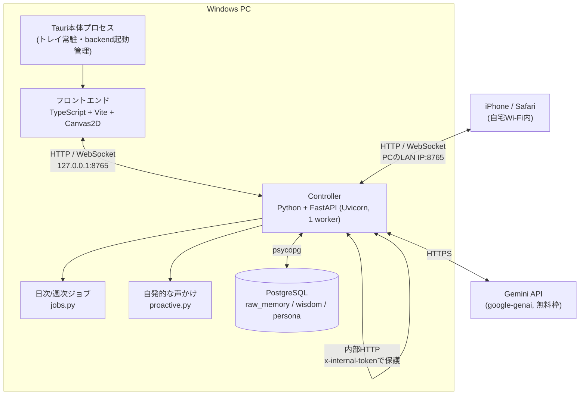
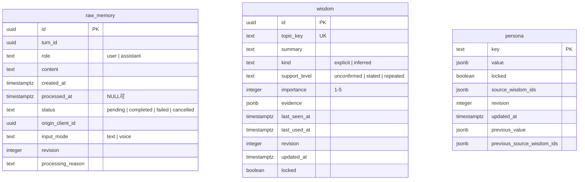

# かぐやAI

Windows PCに常駐する個人用のデスクトップキャラクター「かぐや」とのチャットアプリです。日常の相談・雑談を目的とし、会話はPostgreSQLに保存され、日次で「知恵」として要約されて翌日以降の会話に活かされます。Gemini APIの無料枠のみを使い、有料モデルへの自動切替や課金判定は一切行いません。

開発機でそのまま動かす前提で、配布用インストーラーはありません。音声入出力とiPhone接続のHTTPS化は未実装です（→[未実装・今後](#未実装今後)）。

## 目次

**使い方**：[セットアップ](#セットアップ) ／ [起動と終了](#起動と終了) ／ [会話する](#会話する) ／ [予約した声かけ](#予約した声かけリマインダー) ／ [簡易表示](#簡易表示デスクトップマスコット) ／ [設定](#設定) ／ [記憶の仕組みと編集](#記憶の仕組みと編集) ／ [自発的な声かけ](#自発的な声かけ) ／ [iPhoneから使う](#iphoneから使う) ／ [困ったとき](#困ったとき)

**開発・保守**：[アーキテクチャ](#アーキテクチャ) ／ [技術スタック](#技術スタック) ／ [ディレクトリ構成](#ディレクトリ構成) ／ [API仕様](#api仕様) ／ [DB設計](#db設計) ／ [テスト](#テスト) ／ [未実装・今後](#未実装今後)

---

# 使い方

## セットアップ

初回のみ必要です。このフォルダを他のPCへコピーしただけでは動きません（`.venv`・`node_modules`・ビルド成果物はコピー対象外の想定）。

### 必要なソフト

| ソフト | 用途 |
|---|---|
| Python 3.11以降 | backend（FastAPI）の実行 |
| Node.js LTS + npm | frontendのビルド |
| Rust stable + MSVC Build Tools + Windows SDK | Tauriのビルド |
| WebView2 Runtime | Windowsの画面表示エンジン |
| PostgreSQL | 会話・記憶の保存先（Windowsサービスとして常時起動） |

### 手順

**1. Gemini APIキー** — 個人用のGoogle AI Studioで、課金未接続のプロジェクトのキーを取得します。

**2. PostgreSQL** — 専用のデータベースとロールを作成します。

```sql
CREATE ROLE kaguya WITH LOGIN PASSWORD '<任意のパスワード>';
CREATE DATABASE kaguya_ai OWNER kaguya;
GRANT ALL ON SCHEMA public TO kaguya;  -- PostgreSQL 15以降は明示的な付与が必要
```

**3. backend環境**

```powershell
cd C:\kaguya-ai\backend
py -3.11 -m venv .venv
& .\.venv\Scripts\python.exe -m pip install -r requirements.txt
copy .env.example .env
```

続けて`.env`を編集します。**この3つはアプリ画面からは設定できません。** 変更後はアプリを再起動してください。

```ini
GEMINI_API_KEY=（取得したキー）
GEMINI_MODEL=gemini-3.5-flash-lite
DATABASE_URL=postgresql://kaguya:<パスワード>@127.0.0.1:5433/kaguya_ai
```

> ポート番号は環境のPostgreSQL設定に合わせてください（標準は5432）。

**4. frontend環境**

```powershell
cd C:\kaguya-ai\frontend
npm install
```

**5. 初回起動** — `C:\kaguya-ai\start.bat` をダブルクリックします。DBスキーマの準備（追加のみ・既存データは消しません）とビルドを自動で行います。初回ビルドは数分かかることがあります。

## 起動と終了

| 操作 | 方法 |
|---|---|
| 起動 | `start.bat` をダブルクリック（起動済みなら既存ウィンドウを表示） |
| 終了 | タスクトレイの「終了」／キャラクターを右クリック→「終了」／`stop.bat` |
| ウィンドウを閉じる（×） | 常駐したまま非表示になるだけで、終了はしません |
| 再表示 | タスクトレイのアイコンをクリック、またはトレイメニューの「表示」 |

保存済みの記憶は終了後もDBに残ります。生成中・未保存の回答は失われる場合があるため、「保存のみ再試行」で保存を確認してから終了してください。PostgreSQLサービス自体はアプリ終了時に停止しません。

## 会話する

上部のタブで「会話」「設定」「記憶」「使い方」を切り替えます。

- 入力欄にテキストを入力し、**Enter**または「送信」で送ります（最大2,000文字、同時に1件のみ）。改行は**Shift+Enter**です。
- 返事を待っている間も次の文章を書けます。実際に送信できるのは返事が届いてからで、書きかけの文章は消えません。
- 生成中は「生成停止」で、自分の端末から送った分を止められます（外部API側の処理や利用枠の消費まで止まる保証はありません）。
- 失敗した会話は「再送する」で同じIDのまま再試行できます。回答は生成済みで保存だけ失敗した場合は「保存のみ再試行」が出ます。
- 「以前の会話を読み込む」で過去の履歴を50往復ずつ遡れます。
- 入力欄の先頭で**↑キー**を押すと、送信済みの文章を新しい順に呼び戻せます（↓で戻ります）。言い直しや再送に使えます。

キャラクターの絵は状態に応じて切り替わります。待機中だけは4枚を45秒ごとにゆっくり巡回し、それ以外の状態は1枚で固定です。

| 表情 | 状態 |
|---|---|
| 手を振る → 本を読む → パソコン → トランプ | 待機中（45秒ごとに巡回） |
| 考えている | 返事を生成中 |
| 話している | 返事を表示した直後（約6秒） |
| 笑っている | 自発的な声かけの直後（約6秒） |
| 眠っている | 静音中、または10分以上会話がない |
| 書いている | 記憶の整理を実行中 |

## 予約した声かけ（リマインダー）

会話の中で「**明日の朝9時に薬を飲むって言って**」「30分後に教えて」のように頼むと、その時刻にかぐやが吹き出しで伝えます。日時の解釈はGeminiが行うため、決まった書き方はありません。

- 予約の一覧と取り消しは「設定」タブの**予約した声かけ**にあります。
- 時刻になるとウィンドウが自動的に前に出ます（PCのみ）。吹き出しは**クリックするまで消えません**。
- 静音中でも配信されます。本人が時刻を指定したものなので、握り潰さない方針です。
- **PCがスリープ中・アプリ終了中は鳴りません。** 過ぎた分は次に起動したとき（30秒以内）にまとめて表示されます。
- iPhoneでは、Safariでこの画面を開いている間だけ届きます。プッシュ通知には対応していません（HTTPS化とWeb Pushが必要なため）。

**「これ覚えておいて」** と頼むと、日次の自動整理を待たずにその場で知恵として保存します。自動更新で上書きされないよう保護された状態で入るので、修正・削除は「記憶」タブから行ってください。

どちらもGeminiの関数呼び出しで実現しています。道具を使った回だけAPIの往復が1回増えますが、通常の雑談は従来どおり1回のままです。

## 簡易表示（デスクトップマスコット）

タブ・履歴・設定をすべて省き、透過背景のキャラクターだけを画面右下（タスクバーのすぐ上）に表示するモードです。作業の邪魔をせず、ちょっとした会話だけしたいときに使います。

| 操作 | 方法 |
|---|---|
| 通常 → 簡易 | 「簡易表示に切り替え」ボタン、またはキャラクターを右クリック→「簡易表示に切り替え」 |
| 簡易 → 通常 | キャラクターを**ダブルクリック**、またはキャラクターを右クリック→「通常表示に戻す」 |

- 入力はキャラクター上部の枠線付き欄に打ち、**Enter**で送信します（送信ボタンはありません）。
- 返答はキャラクター上部の吹き出しに出て、8秒後に消えます。**吹き出しをクリックすればすぐ閉じられます**（表示中は入力欄が隠れるため、続けて話しかけたいときに使います）。
- 履歴の閲覧、設定・記憶の編集はできません。通常表示に戻ってください。
- ウィンドウは右下固定で、ドラッグでは動かせません。通常表示に戻すと、切り替える直前の位置・サイズに復元されます。
- 選んだ表示モードは`localStorage`に記憶され、次回の`start.bat`起動でも同じモードで開きます。

**Windowsサインイン時に自動起動する** — `register_autostart.bat`を実行すると、「サインイン時に`start.bat --mini`を実行する」タスクがタスクスケジューラに登録されます（管理者権限は不要）。この経路では前回のモードに関わらず必ず簡易表示で開始します。解除は`unregister_autostart.bat`です。手動で`start.bat`を実行した場合は従来どおり前回のモードで開きます。

## 設定

「設定」タブで変更し「設定を保存」を押すと、次回起動後も有効です。保存先は`%LOCALAPPDATA%\KaguyaAI\settings.json`（`DATA_DIR`環境変数で変更可）で、会話本文はここに複製されません。

| 設定項目 | 範囲・初期値 |
|---|---|
| 自発的な声かけを停止する | 初期OFF。ONでもユーザーからの会話には応答します |
| 記憶を自動整理する | 初期ON。日本時間03:00と、起動時の未処理回収 |
| 声かけの間隔（分） | 60〜240、初期60 |
| 整理APIの1日上限 | 1〜3回、初期3回（手動・自動・週次・失敗分すべてを含む） |
| 回答の出力上限（トークン） | 256〜8,192、初期1,024 |
| ウィンドウを最前面にする | 初期ON |
| 文字サイズ | 12〜22、初期14 |

> **出力上限について**：思考するモデル（`gemini-3.5-flash-lite`等）は、この上限を内部推論で先に消費してから本文を書きます。上限が小さいと本文が空のまま返るため、「出力上限に達して回答が空でした」と表示されたらこの値を増やしてください。

## 記憶の仕組みと編集

会話は3層で管理されます。

1. **会話の原文（`raw_memory`）** — ユーザー発言とかぐやの回答をそのまま保存します。
2. **知恵（`wisdom`）** — 日次03:00と起動時の取りこぼし回収で、未処理の会話を最大30件ずつGeminiへ送り、長く使えそうな好み・事実として要約します。文脈の取り違えを防ぐため、かぐや側の回答も先頭160文字だけ添えて渡します（かぐやの発言自体は事実として抽出しません）。次回以降の会話では、関連する知恵を最大5件だけ参考情報として渡します。想起の優先順位は「一致した語数×2＋重要度＋明示的な知恵に加点」で決まります。
3. **接し方（`persona`）** — 週次（日曜03:00）に、**別日3日以上**の明確な根拠がある場合のみ1項目だけ更新します。基本性格（`base_personality`）は自動更新されません。

「記憶」タブから各層を部分一致で検索し、「根拠・処理情報」で根拠IDや処理日時を確認できます。「訂正」「削除・関連記憶も取消」を選ぶと、影響範囲（関連する会話・知恵・接し方の件数）を示す確認画面が出ます。**実行すると取り消せません。**

設定タブの「今すぐ整理」で日次・週次と同じ処理を手動実行できます（1日の上限に含まれます）。

原文は処理済みかつ7日を過ぎると削除されますが、これは「忘れてほしい」という操作とは別で、知恵の要旨は残ります。完全に忘れさせたい場合は「記憶」タブで知恵そのものを削除してください。なお、Gemini APIへ送信済みのデータを削除する機能はありません。

## 自発的な声かけ

画面が見えていて操作可能な状態のとき、起動時の挨拶または最後の会話から設定した間隔が経過すると、**定型文**の吹き出しを1回だけ表示します。LLM・音声・DB保存のいずれも使いません。

- 返事がなければ、それ以上は話しかけません。
- 非表示・最小化・PCロック中・会話生成中は表示せず、復帰後にまとめて表示することもありません（PCではウィンドウの可視状態、iPhone・ブラウザではタブの表示状態で判定します）。
- 停止方法は「静かにする」ボタン、トレイの「静音／声かけ再開」、設定画面、または会話で「静かにしてて」と送ることです。再開時はタイマーがリセットされ、すぐには話しかけません。
- 声かけへの返事は、直前の定型文1件だけを会話文脈に加えます。原文・知恵の根拠としては保存されません。
- 文言は朝・昼・夕・夜の時間帯ごとに複数用意し、起動時の挨拶と間隔経過時の一声を使い分けます（`proactive.py`の`GREETINGS`／`NUDGES`）。

## iPhoneから使う

自宅Wi-Fi内に限り、iPhoneのSafariからPCと同じ画面・会話・記憶にアクセスできます。PC側と同じUI・APIをLAN経由で共有しており、iPhone専用のビルドやエンドポイントはありません。

> **認証はありません。同じWi-Fiに接続していれば誰でも開けます。** 通信もHTTP平文です。ルーター自体が信頼できないWi-Fi（共用オフィス等）では使用しないでください。

**手順**

1. PCで`ipconfig`を実行し、「IPv4 アドレス」（例：`192.168.1.20`）を確認します。
2. 初回のみ、管理者権限のPowerShellでファイアウォールを開けます。`-Profile Private`により、自宅などプライベートネットワークに設定した回線からのみ許可されます。

   ```powershell
   New-NetFirewallRule -DisplayName "KaguyaAI LAN" -Direction Inbound -Protocol TCP -LocalPort 8765 -Profile Private -Action Allow
   ```

3. PCでかぐやAIを起動した状態で、iPhoneのSafariで`http://192.168.1.20:8765/`を開きます。
4. 共有ボタンから**「ホーム画面に追加」**しておくと、次回からアイコン1つで開けます（Safariのタブとして開きます）。
   > iOSの「ホーム画面Webアプリ」としての全画面起動は**HTTPS必須**のため、HTTP接続の本アプリでは利用できません（`apple-mobile-web-app-capable`を付けると`HTTPS-Only`エラーで起動できなくなります）。全画面化したい場合は、HTTPS化（正本仕様書の工程6フル要件）が前提になります。

**制約**

| 制約 | 内容 |
|---|---|
| 認証なし・HTTP平文 | 同一Wi-Fi内の誰でも会話・記憶を閲覧・操作できます |
| 同一Wi-Fi限定 | モバイル回線・外出先・公衆Wi-Fiからは接続できません |
| PCの起動が前提 | PCがスリープ・シャットダウン中は利用できません |
| IPアドレスは変動しうる | 接続できないときは手順1をやり直してください |
| トレイ・ウィンドウ制御なし | 最前面切替や簡易表示はPC専用です（会話・設定・記憶タブは共通） |

## 困ったとき

| 症状 | 確認すること |
|---|---|
| Pythonを起動できない | `backend/.venv`が存在し、`requirements.txt`のインストールが完了しているか |
| `Database setup failed` | PostgreSQLサービスが起動しているか、`backend/.env`の接続先が正しいか（キー・パスワードはチャット等に貼らない） |
| ポート8765を使用できない | 別で起動しているかぐやAI・開発サーバーを、その起動元から終了する（本アプリが他プロセスを強制終了することはない） |
| 回答が空で返る | 設定の「回答の出力上限」を増やす（→[設定](#設定)の注記） |
| Geminiの利用制限（429） | 表示された待ち時間を目安に手動で再送する。課金切替・別モデル切替は行われません |
| 整理結果の検証失敗 | 原文は保持されるため、1日の上限内で「今すぐ整理」を再実行できる |
| 「記憶が更新されました」と出る | 別の処理と競合。記憶タブを再表示してから操作し直す |
| 画面が見つからない | タスクトレイのアイコンをクリック、または`start.bat`を再実行 |
| 「トレイ操作を接続できませんでした」 | トレイメニューと画面をつなぐ内部連携が張れなかった場合の警告。**画面上のボタン操作には影響しません。** 再起動で解消することがあります |
| `.bat`実行時に文字化けする | バッチファイルは純ASCIIで書いています。日本語コメント等を追記する場合はANSI/Shift-JIS（コードページ932）で保存してください |

---

# 開発・保守

## アーキテクチャ



設計上の要点：

- **プロセス管理** — Tauri本体がbackend（uvicorn）を子プロセスとして起動し、終了時に停止します（Windowsでは`taskkill /T`でプロセスツリーごと）。ポート8765が使用中の場合は、既存プロセスを終了させずにエラー表示します。
- **記憶APIの隔離** — DBを直接操作するAPI（`/internal/memory/*`）は起動時に生成するランダムな内部トークンで保護され、ブラウザのセッショントークンからは呼び出せません。会話・記憶操作はすべてこの内部APIを経由します。
- **1ターン1会話** — 進行中の会話・未保存の回答・記憶の編集は同時に1つだけで、`controller.py`がこの状態を一元管理します。切断しても会話は中断されず、同じIDで結果を回収できます。
- **LAN公開** — uvicornは`0.0.0.0:8765`で待ち受けます。CORSとWebSocketのOrigin検証はプライベートIP帯（192.168.x.x / 10.x.x.x / 172.16-31.x.x）のみを追加で許可し、インターネット側のOriginは拒否します。
- **簡易表示** — フロントエンドのCSS/DOM切替とTauriのウィンドウ操作API（透過・枠なし化、サイズ・位置変更）だけで実現しており、backend側の対応はありません。

## 技術スタック

| 層 | 技術 |
|---|---|
| フロントエンド | TypeScript + Vite、Canvas2D（UIフレームワーク不使用） |
| デスクトップ外枠 | Tauri 2（Rust側の依存は`tauri`のtray-icon機能、`tauri-plugin-log`、`tauri-plugin-single-instance`） |
| バックエンド | Python 3.11以降、FastAPI + Uvicorn、httpx（内部HTTP）、pydantic-settings |
| LLM | google-genai（モデルは`GEMINI_MODEL`環境変数で指定。コードにハードコードなし） |
| DB | PostgreSQL + psycopg（ORM不使用、SQLファイルでマイグレーション） |

## ディレクトリ構成

```
kaguya-ai/
├── start.bat / stop.bat / build.bat        # 起動・停止・ビルド
├── check.bat / check_db.bat / manual.bat   # テスト・マニュアル表示
├── register_autostart.bat / unregister_autostart.bat
├── backend/
│   ├── app/
│   │   ├── main.py         # FastAPIエントリポイント、公開APIとWebSocket
│   │   ├── controller.py   # 会話ターンの状態管理（同時1件）と定期タイマー
│   │   ├── llm.py          # Gemini呼び出し（会話・知恵化・接し方更新）
│   │   ├── memory_api.py   # 内部APIルーター、DB接続
│   │   ├── memory_store.py # 記憶の検索・訂正・削除の中核ロジック
│   │   ├── tools.py        # 会話から使える道具（予約した声かけ・即時記憶）の宣言と実行
│   │   ├── jobs.py         # 日次・週次ジョブ
│   │   ├── proactive.py    # 自発的な声かけのタイマー
│   │   ├── runtime.py      # 設定と実行台帳の永続化（settings.json）
│   │   ├── persona.py      # システムプロンプト・会話文脈の組み立て
│   │   └── models.py / errors.py / config.py
│   ├── migrations/         # 001_init.sql（初期スキーマ）／002_memory_jobs.sql（追加カラム・初期persona値）／003_reminders.sql（予約した声かけ）
│   ├── migrate.py          # 追加のみのマイグレーション適用
│   ├── tests/              # 単体テスト（unittest）とDB統合テスト
│   └── .env / .env.example / requirements.txt
├── frontend/
│   ├── index.html
│   ├── src/
│   │   ├── main.ts         # セッション・履歴・WebSocket、簡易表示の切替とウィンドウ制御
│   │   ├── controls.ts     # 設定・記憶編集UIのロジック
│   │   ├── avatar.ts       # スプライト描画（状態ごとの割り当て、9枚すべてを使用）
│   │   └── tauri.ts / style.css
│   ├── public/             # manual.html（アプリ内マニュアル）、sprites/（画像9枚）
│   ├── src-tauri/src/lib.rs  # backend起動・トレイ・ウィンドウ制御
│   └── tests/
└── docs/                   # 企画・仕様ドキュメント（実行には不要）
    ├── kaguya_ai_final_spec_and_quickstart.md  # 正本仕様書
    ├── kaguya_ai_codex_handoff.md / kaguya_ai_handoff_v2.md  # 過去の引き継ぎメモ
    └── kaguya_ai_concept.pdf / img.png         # 企画資料・スプライト原本
```

## API仕様

`http://127.0.0.1:8765`（PC）または`http://<PCのLAN IP>:8765`（iPhone）でアクセスします。Bearerトークンは`POST /session`で発行します。

| メソッド・経路 | 認証 | 用途 |
|---|---|---|
| `GET /health` | なし | 起動確認 |
| `POST /session` | なし | セッショントークン発行 |
| `GET /history` | Bearer | 会話履歴取得（カーソルページング） |
| `GET /settings` ／ `PATCH /settings` | Bearer | 設定と整理ジョブ状態の取得・変更 |
| `POST /jobs/run` | Bearer | 記憶整理の手動実行 |
| `DELETE /reminders/{id}` | Bearer | 予約した声かけの取り消し（登録は会話から行う） |
| `GET /memories/{layer}` | Bearer | 記憶検索（layer: raw / wisdom / persona） |
| `GET /memories/{layer}/{key}/impact` | Bearer | 訂正・削除時の影響範囲を確認 |
| `PATCH /memories/{layer}/{key}` | Bearer | 記憶の訂正・削除 |
| `POST /memories/persona/{key}/restore` | Bearer | 接し方を直前の値へ復元 |
| `WS /ws?token=...` | クエリtoken + Origin検証 | リアルタイム会話 |
| `/internal/memory/*` | 内部トークン専用 | DB直接操作（外部から直接呼べない） |

**WebSocketイベント**

- クライアント→サーバー：`chat.send` / `chat.cancel` / `chat.retry_save` / `presence`（画面の可視状態）
- サーバー→クライアント：`state.changed` / `chat.accepted` / `chat.completed` / `chat.error` / `settings.changed` / `jobs.changed` / `memories.changed` / `proactive.message` / `reminder.due`

音声関連（`/audio/*`）は未実装です。

## DB設計



- `raw_memory`は`UNIQUE(turn_id, role)`で1往復（ユーザー発言＋AI回答）を保証します。
- `revision`列は楽観的ロックに使い、記憶の訂正・削除では影響範囲のハッシュ（`impact_token`）と併せて競合を検出します。
- **マイグレーションに版管理テーブルはありません。** `migrate.py`は「`raw_memory`が存在しなければ001を適用し、002以降は毎回流す（`IF NOT EXISTS`・`ON CONFLICT DO NOTHING`で冪等）」という実装です。ファイルを追加したときは`migrate.py`のリストにも名前を足してください。

## テスト

| コマンド | 内容 |
|---|---|
| `check.bat` | backend単体テスト（unittest・20件）＋frontendテスト（node --test・10件）＋ビルド確認。実際のGemini API・本番DBには接続しません |
| `check_db.bat` | 使い捨てのローカルPostgreSQLクラスタによるDB統合テスト（アプリ本体のDBは使いません） |
| `manual.bat` | アプリ内マニュアル（`frontend/public/manual.html`）をブラウザで開く |

`backend/tests/`の内訳は、`test_api.py`（APIエンドポイント）、`test_llm_schema.py`（Gemini応答スキーマ）、`test_recovery.py`（異常終了からの復旧）、`test_stage4.py`（記憶編集・設定・声かけ・ジョブ）、`test_tools.py`（予約した声かけの日時解釈）、`run_db_checks.py`（DB統合テスト本体）です。コードを変更したら`check.bat`を実行してください。これだけで大半の不具合は検出できます。

> `check_db.bat`は`run_db_checks.py`内でPostgreSQLの実行ファイルを`C:\Program Files\PostgreSQL\18\bin`と仮定しており、インストール先が違うと応答が返らないことがあります。その場合は環境変数`TEST_POSTGRES_BIN`に正しいパス（`...\bin`まで）を設定してください。`check.bat`が通っていれば必須ではありません。

## 未実装・今後

- **音声入出力**（Whisperによる文字起こし、VOICEVOXによる読み上げ）
- **iPhone接続のHTTPS化・証明書配布・ペアリング認証** — 現状は認証なしのHTTP平文です（→[iPhoneから使う](#iphoneから使う)）
- **配布用インストーラー**

着手する場合は、正本仕様書`docs/kaguya_ai_final_spec_and_quickstart.md`の工程5（音声）または工程6の残り（HTTPS化・ペアリング認証）が次の手順です。

技術的な改善候補としては、Hostヘッダ検証（DNSリバインディング対策）、記憶のエクスポート機能、接し方の訂正時に根拠の会話を物理削除している挙動の見直し、backendのログ出力、リリースビルドでの配布が挙がっています。
