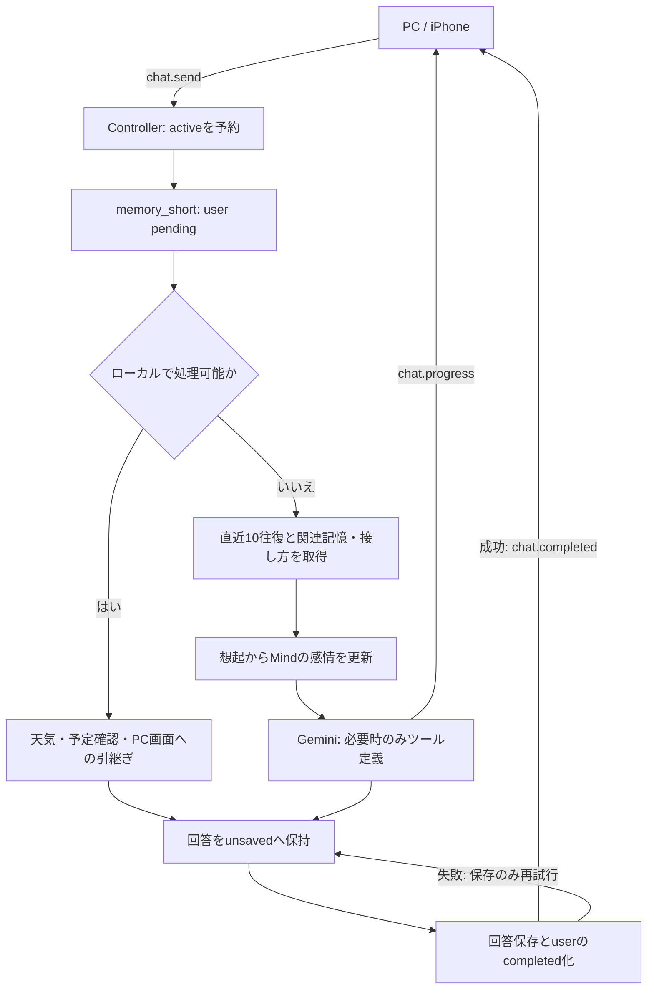
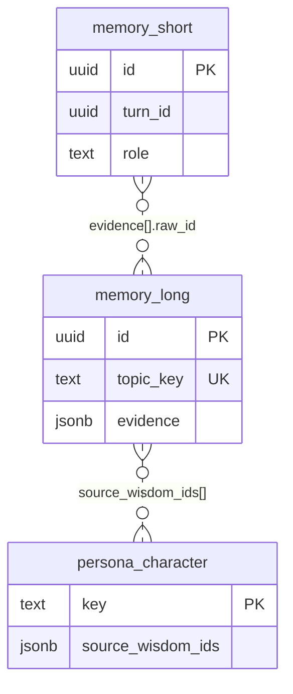

# かぐやAI

会話を覚え、日々の接し方へつなげる個人用AIキャラクターです。Windows PCを母艦に、PCとiPhoneで同じ会話・記憶・生活状態を共有します。


**現行仕様：2026年9月12日のコード確認版。** 概要からDB・APIまで順に読める資料は [Spec v2（PDF）](docs/Spec_v2.pdf) を参照してください。過去資料は [docs/old](docs/old) に保存しています。

## 読む順序

1. コンセプトと主な機能を知る。
2. セットアップ、基本操作、PC・iPhoneの使い方を読む。
3. 記憶、Living、Mindの動きを理解する。
4. 後半のアーキテクチャ、DB、API、技術スタックを確認する。
5. 起動・更新・検証とトラブルシュートを確認する。

## Memory × Living × Persona

| 系統 | 対象 | 役割 |
|---|---|---|
| Memory | ユーザー | 会話、長期的な事実・好み、未完の予定や気がかりを覚える |
| Living | かぐやの今 | 感情・活動・元気さを表し、全端末で共有する |
| Persona | かぐやの性格 | 人格・接し方・かぐや自身の好みを保持する |

会話からの「学習」は、記録・抽出・想起を通じて次のプロンプトへ情報を渡す仕組みです。Geminiの重みを更新するFine-tuningは行いません。感情の数値はキャラクター用の内部指標です。

## 現在の主な機能

- Geminiによる文字チャット
- 更新メモによる変更内容の説明。更新後の挨拶で一度だけ紹介し、「何が変わった？」には紹介後も回答する（追加のLLM呼び出しなし）。
- PostgreSQLへの会話保存
- 会話原文から長期記憶を作り、継続した希望を接し方へ反映する記憶
- 「これ覚えておいて」による即時記憶
- 指定時刻のリマインダー
- リマインダーは吹き出しをクリックして確認するまで保持（複数件は順に表示、次の通知は最大約30秒後）
- ローカルカレンダー
- Open-Meteoによる天気取得
- `%LOCALAPPDATA%\KaguyaAI\references` の参照ファイル検索
- README / docs / ソースコードの読み取り専用自己参照
- 通常チャットのストリーミング表示（書き終わるのを待たずに読み始められる）
- 「接続中」「回答を生成中」「保存中」の進捗表示と、常設の接続状態表示
- 返答のあとに出る定型の追いかけボタン（「もっと詳しく」など。候補生成のためのLLM呼び出しはしない）
- 書きかけの端末内保存（送信が受理されると消える）
- PC版の通常表示 / 簡易表示
- `kaguya.bat` からの更新（ダブルクリックでメニュー）
- 同一LAN内のiPhoneブラウザからの利用
- Tailscale Serveによる、本人のTailscale環境からのプライベートHTTPSアクセス（Funnel不使用）
- Gemini Liveによる双方向の音声会話（字幕を会話履歴へ保存、音声データ自体は保存しない）
- ファイルタブから、登録したフォルダ内のMP4動画を検索・再生
- ファイルタブから、事前登録したBATを確認付きで実行
- 通常チャットから「○○の動画を再生して」「○○を実行して」と頼むと、依頼した端末のファイルタブへ引き継ぎ（BATは必ず実行前確認）
- Living Kaguya（生活状態、軽い感情、低負荷モーション、利用時間帯の学習）
- Kaguya Mind（実験機能・新規設定の既定ON。かぐや自身の感情・好み・未完の話題をローカルに育てる）
- 記憶画面の「かぐやの心」で、Mindの保存内容を日本語の項目名で閲覧・検索

アプリ画面の「使い方」（`frontend/public/manual.html`）は、**このREADMEから自動生成しています**。
`<!-- manual:start -->` 〜 `<!-- manual:end -->` で囲んだ範囲がそのまま「使い方」になります。直接編集しないでください。

- 生成：`npm run build`（前段で自動実行）または `npm run manual`
- 検証：`node scripts/build-manual.mjs --check`（CIで実行。生成物のコミット漏れを止めます）

変換できない記法に出会うと、行番号を示して失敗します。対応しているのは見出し・段落・箇条書き・表・コードブロック・太字・インラインコードです。

---

# 安定性優先の動作

## 会話を最優先

記憶整理中にユーザーが話しかけた場合は、整理処理をキャンセルして通常チャットを優先します。未処理の会話原文は削除しません。

Gemini APIは以下の方針です。

- 通常チャットは低Thinking設定
- 記憶整理も低Thinking設定
- Geminiの一時的な500/502/503/504、ネットワークエラーだけ短く1回再試行
- 429（利用制限）は自動で繰り返さず、ユーザーへ返す
- 長いタイムアウト後の自動再試行はしない

## 記憶整理

自動整理をONにしている場合、**未整理の会話があり、かつ会話が5分以上途切れているとき**に、少量ずつ整理します。

- 確認間隔は15分。自動整理は1回につき最大3バッチ。各バッチの前に会話の有無を確認
- **未整理が30件（設定値）に届くまで自動整理は動きません。** 1回の整理は最大60件をまとめて扱うため、数件のために呼ぶと1件あたりのAPI消費が増えます
- ただし**24時間以上たった未整理は、件数に関わらず整理します。** あまり話さなかった週の数件が置き去りにならないようにするためです
- 未整理の会話が無い場合、日次の知恵抽出はGemini APIを呼びません。週次の接し方更新が必要な場合は別途実行します
- 自動整理の1日上限（設定値。1〜10回、既定3）を超えたら、その日の**自動実行は**打ち切り。「今すぐ整理」は上限に関係なく実行できます
- **失敗したときの歯止め**：API呼び出しが失敗したら使った枠を戻します。ただし同じ日に2回続けて失敗したら、その日の自動整理は止めます（直らない理由で叩き続けないため）。「今すぐ整理」は止めません
- 1バッチで最大60件のユーザー発言を処理します（回答の短い抜粋込みで約12,000文字まで）。週次更新もAPI上限を使うため、1日480件を保証するものではありません。自動整理は1回の実行で最大3バッチ続け、話しかけられた時点で中断します
- 上限に達しても未整理の会話は消えません。知恵への反映が遅れるだけです
- 会話が始まったら整理を中断し、未処理の原文は保持

会話していない時間に少しずつ進めるので、深夜まで待たずに知恵へ反映されます。逆に、
会話中や連続操作中にバックグラウンドのGemini呼び出しが割り込むことはありません。

「設定 → 今すぐ整理」は手動でいつでも実行できます。1回押すと最大5バッチ（約300件）まで処理して止まります。足りなければもう一度押してください。1日の上限はありません。整理失敗時は、分かる範囲で利用制限・タイムアウト・結果形式不正・保存失敗を区別して表示します。

設定画面には、前回の整理が**いつ・どうなったか**と、今日の使用回数が1行で出ます。日をまたいでも消しません（時刻が付くので、古い結果が今のことのように見える心配はありません）。

### Geminiへ渡すスキーマの制約

整理の結果は `response_schema` で形を指定して受け取ります。**ここにPydanticの型をそのまま渡すと通りません。**

| 送ると400になるもの | 出どころ |
|---|---|
| `additionalProperties` | `model_config = ConfigDict(extra='forbid')` |
| `max_items`（入れ子の配列に付けた場合） | `Field(max_length=...)` |
| `minimum` / `maximum` / `minLength` / `maxLength` | `Field(ge=..., min_length=...)` |

そのため `backend/app/llm.py` の `WISDOM_SCHEMA` / `PERSONA_SCHEMA` は、受け付けられる形だけで手書きしています。**値の範囲や件数の上限は、受信時に `WisdomBatch` / `PersonaCandidate` が検証します** — 送る形を緩めても、受け取りのチェックは緩めていません。

送る形と検証用の型がずれていないことは `backend/tests/test_llm_schema.py` で見ています。項目を足すときは両方に足してください。

この制約に気づかず自動生成していたため、整理は長期間ずっと400で失敗し、原文が数百件たまっていました。エラーは画面にも出ますが「Geminiへの接続に失敗しました」としか出ないので、設定ミスと区別がつきません。

<!-- manual:start -->
## 天気

「今日の天気は？」「傘いる？」「足立区の明日の天気」のような明示的な天気質問は、Geminiを呼ばずOpen-Meteoへ直接問い合わせます。

- APIキー不要
- 30分キャッシュ
- 外部API障害時は直近6時間以内の成功結果をフォールバック可能
- 「今日は寒いね」のような雑談だけでは強制的に天気APIへ送らない

既定地点は東京です。会話で「天気の場所を横浜にして」のように変更できます。
<!-- manual:end -->

## 予定の確認

「今日の予定は？」「明日なにかある？」のような**確認だけ**の質問は、Geminiを呼ばずローカルの予定表から直接答えます。
予定の追加・削除・変更や、「明日15時の予定」のように時刻を含む依頼は、これまでどおりGeminiが解釈します。

## 更新

通常の `start.bat` は**Gitを変更しません**。
最新版を取り込むのは、`kaguya.bat` の `update` を明示的に実行したときだけです。

更新時は外部PowerShellヘルパーが以下を行います。

1. 現在のかぐやAI終了を待つ
2. `update_repo.bat` で `origin/main` を `--ff-only` 更新
3. ビルド
4. かぐやAIを再起動

オフライン・main以外・ローカル変更あり等で更新できない場合でも、現在版の再起動を試みます。
ログは `%LOCALAPPDATA%\KaguyaAI\update.log` です。

---

# セットアップ

## 必要な環境

| ソフト | 用途 |
|---|---|
| Python 3.11以降 | FastAPI backend |
| Node.js + npm | frontend build |
| Rust stable + MSVC Build Tools + Windows SDK | Tauri build |
| WebView2 Runtime | PC画面 |
| PostgreSQL | 会話・長期記憶 |
| Git | 更新（`kaguya.bat update`） |
| Tailscale（任意） | 外出先からのプライベートHTTPS利用、iPhoneでの音声会話 |

Python 3.13系でも、requirementsが正常にインストールできれば利用できます。

## PostgreSQL

専用DB/ロールを用意します。例：

```sql
CREATE ROLE kaguya WITH LOGIN PASSWORD '<任意のパスワード>';
CREATE DATABASE kaguya_ai OWNER kaguya;
```

## backend

```powershell
cd C:\kaguya-ai\backend
py -3.13 -m venv .venv
& .\.venv\Scripts\python.exe -m pip install -r requirements.txt
copy .env.example .env
```

`backend/.env` を編集します。

```ini
GEMINI_API_KEY=...
GEMINI_MODEL=利用するGeminiモデル名
GEMINI_LIVE_MODEL=gemini-3.1-flash-live-preview
DATABASE_URL=postgresql://kaguya:<password>@127.0.0.1:5432/kaguya_ai
```

秘密情報はGitへコミットしないでください。

## frontend

```powershell
cd C:\kaguya-ai\frontend
npm install
```

## 起動

```bat
C:\kaguya-ai\start.bat
```

起動時にDBマイグレーションとローカルビルドを行います。パッケージの自動インストールはしません。

---

<!-- manual:start -->
# 起動と終了

- 起動は `C:\kaguya-ai\start.bat`。DBマイグレーションとビルドを行って起動します
- **通常起動ではGitHubから自動更新しません。** 使っている版を勝手に変えない設計です
- 終了はタスクトレイの「終了」または `stop.bat`。ウィンドウの×は常駐したまま非表示になります
- iPhone画面には更新ボタンを出しません。PCのソース更新・再ビルドはPC版からだけ実行します

**PC版はタスクバーに出しません。タスクトレイが唯一の入口です。**

- **トレイのアイコンを左クリックすると、簡易表示で出ます。** 通常表示で開いていたときも簡易表示へ切り替わります
- 通常表示へ戻すのは、キャラのダブルクリックか右クリックメニューです
- トレイの右クリックメニューからは「表示」「非表示」「静音／声かけ再開」「設定」「終了」を選べます

## PC起動時から常駐させる

`kaguya.bat` をダブルクリック → `5` で登録します。管理者権限は不要です。

- かぐやは**簡易表示**で起動し、タスクトレイに常駐します
- AivisSpeech も一緒に起動します。よくある置き場（`%LOCALAPPDATA%\Programs\AivisSpeech` など）を探して見つかれば登録します
- 見つからなかった場合はその旨を表示します。Win+R で `shell:startup` を開き、AivisSpeech のショートカットを置いてください
- AivisSpeech が起動していないと、通話は Gemini の声に切り替わります（会話自体は続きます）
- 解除は同じ `5` から。両方の登録を外します
- 登録先は Windows の**スタートアップフォルダー**（Win+R → `shell:startup`）です。`Kaguya AI.cmd` と `Kaguya AI Voice.cmd` が置かれます

# 設定

設定は PostgreSQL の `app_settings` テーブル（`options` 行）に入っています。画面から変えられるのは一部だけなので、それ以外は**キー名**でこの行を直接編集します。変更はアプリの起動時に読み込まれます。

**全16項目です。ここに無いキーを書くと設定が読めなくなり、既定値で起動します**（壊れた設定は `options_bad` へ退避されます）。

## 声かけ・記憶

| キー | 意味 | 範囲・既定 |
|---|---|---|
| `quiet` | 自発的な声かけを停止。ONでもユーザーからの会話には応答します | true / false、既定 false |
| `proactive_minutes` | 声かけの間隔 | 60〜240分、既定60 |
| `auto_jobs` | 会話していない時間に記憶を自動整理する | true / false、既定 true |
| `auto_call_limit` | 自動整理の1日上限。**自動整理と週次更新だけ**が使います。「今すぐ整理」は上限で止まりません | 1〜10回、既定3 |
| `organize_min_rows` | 自動整理を始める下限。未処理がこの件数に届くまで自動整理は動きません。ただし24時間たった未整理は件数に関わらず整理します | 1〜200件、既定30 |
| `mind_enabled` | 実験機能「Kaguya Mind」。ONにするとかぐや自身の感情・好み・気にかけていることが育ちます。新規の既定はON。設定画面に切替欄はありません | true / false、既定 true |

Kaguya Mindの蓄積を消すのは設定画面から行います。育った感情・好み・気にかけていることだけを削除し、会話と記憶は消えません。

## 会話と画面

| キー | 意味 | 範囲・既定 |
|---|---|---|
| `reply_tokens` | 回答の出力上限 | 256〜8,192トークン、既定1,024 |
| `font_size` | 文字サイズ | 12〜22、既定14 |
| `always_on_top` | 最前面表示。PC/Tauri画面に適用（iPhoneでは表示しません） | true / false、既定 true |
| `weather_location` | 天気の既定地点。会話からも変えられます | 80文字まで、既定「東京」 |

## 声

| キー | 意味 | 範囲・既定 |
|---|---|---|
| `voice_name` | 通話の声。名前の一覧はGemini側に従います。無効な名前だと通話開始時に失敗し、その旨と使った名前が画面に出ます | 英数字40文字まで、既定 `Leda` |
| `voice_style` | 話し方。トーン・語尾・テンポを言葉で指示します。空にするとモデルの素の話し方になります | 300文字まで |
| `voice_engine` | 読み上げをどこに任せるか。`gemini` はGemini Liveの声をそのまま流します。`local` はPCのVOICEVOX互換エンジンで読み上げ、繋がらなければ `gemini` へ自動で戻ります | `gemini` / `local`、既定 `gemini` |
| `tts_url` | ローカル読み上げエンジンの場所。AivisSpeech は 10101、VOICEVOX は 50021 | 200文字まで、既定 `http://127.0.0.1:10101` |
| `tts_speaker` | ローカル読み上げの話者 | 80文字まで、既定「コハク」 |
| `tts_style` | ローカル読み上げのスタイル | 80文字まで、既定「ノーマル」 |

# デザインの決めごと

PCとiPhoneで同じ画面を使うので、見た目の方針も1つにします。**Apple HIGに倣う**のが基本方針です。

数値は `frontend/src/style.css` の `:root` にまとめてあり、**個別に書き足しません**。同じ役割のものが場所ごとに違う値になるのを防ぐためです（実際、余白は2〜14px、角丸は8〜18pxが混在していました）。

## 余白

4の倍数だけを使います。

| トークン | 値 | 使うところ |
|---|---|---|
| `--space-1` | 4px | 文字とアイコンの間など、最小の隙間 |
| `--space-2` | 8px | 同じ塊の中の要素どうし |
| `--space-3` | 12px | 塊と塊の間、カードの内側 |
| `--space-4` | 16px | 画面の端、大きな区切り |
| `--space-6` | 24px | 節と節の間 |

## 角丸

役割で3段だけです。

| トークン | 値 | 使うところ |
|---|---|---|
| `--radius-s` | 8px | ボタン、入力欄 |
| `--radius-l` | 12px | カード、領域 |
| `--radius-pill` | 999px | 円形・丸型のボタン |

## 押せるものの大きさ

| トークン | 値 |
|---|---|
| `--tap` | 44px |

HIGの最小ヒットターゲット44ptに合わせます。**入力手段で分けません。** 指で押し間違えないための下限ですが、マウスでも小さい的は狙いにくいためです。

簡易表示（幅160px）だけは、消音・音量・通話を1行に収める必要があるので個別に小さくしています。

## 文字

本文（設定の「文字サイズ」。既定14px）を1として、上下に段階を持ちます。

| トークン | 倍率 | 使うところ |
|---|---|---|
| `--text-title` | 1.25 | 画面の見出し |
| `--text-heading` | 1.05 | 節の見出し |
| 本文 | 1 | 会話、説明 |
| `--text-small` | 0.875 | 補足、日時、状態 |
| `--text-caption` | 0.75 | ラベル、注記 |

**実寸（px）で書いてよい例外**は2つだけです。増やすときは、なぜトークンで足りないのかをCSSのコメントに書いてください。

- **入力欄は16px固定。** iOSは入力欄の文字が16px未満だとページを拡大します
- **吹き出しは実寸で抑える。** 狭い画面やキーボード表示中に、文字サイズの設定と無関係に収めきる必要があります

## フォーカスの枠

キーボード操作で今どこにいるかが分かるよう、`outline` を要素の**外側**に出します。

縦にスクロールする領域は横方向も切り取られるため、**枠が必要とする分の余白を四辺に取ります**。足りないと画面の縁にある操作で枠が欠けます（実際、記憶タブの「会話履歴」で欠けていました）。

## 決めごとを守れているかの確認

`frontend/tests/style.test.cjs` で見ています。

- 生の値（トークンを使っていない余白・角丸・文字）が残っていないか
- スクロール領域の余白が、フォーカス枠に足りているか
- 押せるものの最小サイズが、メディアクエリの外にあるか

---


# 基本操作

## 画面

初期画面は「会話」です。「記憶」「ファイル」「設定」は補助画面で、「使い方」は設定画面の中にあります。
設定画面に入力欄は置いていません。置いてあるのは「使い方」「予約した声かけ」「記憶の整理」だけです。

### データベースの表

[Spec v2](docs/Spec_v2.pdf) のDB章と本README末尾に現行定義があります。要約すると、かぐやが扱うデータは
「誰についての情報か」で3系統に分かれます。

| 系統 | 表 | 役割 |
|---|---|---|
| Memory | `memory_short` / `memory_long` / `memory_concern` | ユーザーを覚える（短期記憶・長期記憶・気がかり） |
| Living | `living_emotion` / `living_activity` | かぐやの今の状態（感情・活動・元気さ） |
| Persona | `persona_character` / `persona_favorite` | かぐやの性格（人格と接し方・好み） |

このほかに `app_settings`（設定と整理の記録）、`calendar_events`、`reminders`、
`schema_migrations`（当てたマイグレーションの記録）があります。

### 設定値の変え方

キー名と範囲は前掲の「設定」を参照してください。

## 会話

画面は上から「タブ（アイコン）」「かぐや」「会話履歴」「入力欄」の4段です。
入力欄は横いっぱいで、その下に音声通話ボタンと送信ボタンを右寄せで置いています。

- PC: Enterで送信、Shift+Enterで改行
- iPhone等のタッチ端末: **改行キーは改行**。送信は送信ボタンだけ
- 送信中は送信ボタンが停止ボタンに入れ替わります
- かぐやの大きさは常に同じです。iPhoneでキーボードを出している間だけ、かぐやを隠して会話履歴を広げます
- 書きかけは端末内に保存され、送信が受理された時点で消えます（送信前にタブが閉じても戻ります）
- 過去の会話を読んでいる間は自動で最下部へ移動しません。「新しい返答 ↓」で戻ります
- 返答は届いた順に表示されます（ストリーミング）
- 返答のあとに「もっと詳しく」「例をあげて」「短くまとめて」が出ます。押すと普通の会話として送るだけです
- 返答の下に実測の所要時間（書き始めまで / 全体）を小さく出します
- 最大2,000文字
- 同時生成は1件
- 失敗した会話は「再送する」
- 回答生成済みで保存だけ失敗した場合は「保存のみ再試行」

## かぐや自身のことを聞く

かぐやは自分のREADME・docs・ソースコードを読み取り専用で読めます。ただし**毎回読みに行くわけではありません**。読みに行くと返答のストリーミングができなくなるため、下の語がメッセージに入っているときだけ道具を渡しています。

| 種類 | 反応する語 |
|---|---|
| 仕様・実装 | 仕様 / 実装 / 設計 / 構成 / アーキテクチャ / バグ原因 |
| 置き場所 | フォルダ / ディレクトリ / リポジトリ / ソース |
| 見た目・動き | モーション / アニメーション / スプライト / まばたき / 立ち絵 |
| 機能と履歴 | 機能 / できること / 変更履歴 / 更新履歴 / コミット |
| 素直な聞き方 | どう作られ / どうやって動い / 自分のこと |
| 英字（大文字小文字は問わない） | readme / docs / project_inspector |

「モーション増えた？」「フォルダの中どうなってる？」「自分のことわかる？」のように、これらの語が入っていれば自分で調べて答えます。

上の語が入っていない質問には、**実際のコードを見ずに答えます**。心当たりのない答えが返ってきたときは、「かぐやの仕様だと〜」「ソースを見て」のように言い換えてください。

語の一覧は `backend/app/tools.py` の `PROJECT_WORDS` にあります。増やすときは、この表も一緒に直してください（ずれるとテストが落ちます）。

## 音声会話

「会話」画面の入力欄にある通話ボタンから、Gemini Liveと双方向に音声会話できます。通話中は同じボタンで終了できます。

- 1回最大10分
- マイク音声は16kHz PCMとしてGemini Liveへ送信し、返答音声をその場で再生（1回最大10分・従量課金）
- 通話中は通話ボタンの左に音量のつまみと消音ボタンが出ます。読み上げがGeminiでもPCのエンジンでも同じつまみで効きます
- 音量と消音は**端末ごと**に覚えます。PCとiPhoneで別々に設定できます（サーバーには送りません）
- 通話中の字幕は画面に出しません。会話が終わると通常の会話履歴に残ります
- 現行のGemini Live設定はNO_INTERRUPTIONです。返答中の発話による自動割り込みは有効にしていません
- 読み上げは PCの [AivisSpeech](https://aivis-project.com/) か [VOICEVOX](https://voicevox.hiroshiba.jp/) に任せられます。使う場合は、通話の前にそのアプリを起動してください
- 繋がらない場合は Gemini の声で通話を続け、理由を画面に出します
- PCの読み上げを使うと、文がそろってから合成するぶん、最初の一声までが少し遅くなります
- 現行設定では、PCの読み上げ中もGemini側は音声を生成します。生成音声は再生せず、出力字幕をローカルTTSへ渡します。ローカルTTSへ切り替えてもGeminiの音声生成は省略されません
- キャラクターごとの利用規約・クレジット表記の条件は、各エンジンの配布元で確認してください
- ユーザー発話と、かぐやの返答の字幕を通常の会話履歴へ保存します
- **音声データ自体は保存しません**
- 通常の長期記憶・Relationship Memory・Kaguya Mindの文脈を会話開始時に参照します
- 音声通話中は文字チャットを同時実行できません
- 音声通話から天気・予定・BAT等の外部操作は実行しません
- PC/Tauri、またはTailscaleのHTTPS接続で利用します。同一LANのHTTP接続ではブラウザのマイク制約により利用できません
- iPhoneから使うには、PCで `pc_setup.bat` を実行し、`1`（Tailscaleを導入）→ `2`（HTTPS接続を有効化）を選びます。
  表示された `https://….ts.net` を、同じTailscaleアカウントでログインしたiPhoneのSafariで開きます
- Gemini Liveの利用量はGemini API側の課金・利用枠に従います

## 進捗と接続状態

画面上部に接続状態（接続中… / 接続済み / 未接続）を常設し、生成中は「接続中」「回答を生成中」「保存中」を出します。
実際には検索していないのに「記憶を探しているよ」のような演出は出しません。

## 終了

- タスクトレイ → 終了
- `stop.bat`

ウィンドウの×はアプリ終了ではなく非表示です。

## 簡易表示

PC版では右上の簡易表示ボタンで、キャラクター中心の小型表示へ切り替えられます。
通常表示への復帰はダブルクリックまたは右クリックメニューです。

出るのはキャラ、1行の入力欄、通話ボタンだけです。

- **送信はEnterキー**。送信ボタンと停止ボタンは出しません
- **通話は簡易表示からも始められます。** 通話中は消音ボタンと音量つまみが並びます
- 吹き出し（声かけ・リマインダー）が出ている間は入力欄が隠れますが、**通話中は隠しません**。隠すと通話を終わらせるボタンまで消えてしまうためです

---

# iPhoneから使う

PCとかぐやAIを起動した状態で利用します。iPhoneはPC側と同じFastAPI・Gemini・PostgreSQLを使い、別アプリや別DBは作りません。

## 家庭内Wi-Fi

PCとiPhoneを同じWi-Fiへ接続し、Safariで開きます。

```text
http://<PCのLAN IP>:8765/
```

文字チャット、記憶、天気、カレンダー、リマインダー、参照ファイル、Living Kaguya、ファイルタブを利用できます。
HTTP接続のため、**iPhoneの音声会話は利用できません**（ブラウザがHTTPSでないとマイクを渡さないため）。
iPhoneで音声会話を使う場合は、次の「外出先から使う（Tailscale）」の設定を行い、そのURLで開きます。家の中でも同じURLが使えます。

## 外出先から使う（Tailscale）

Tailscale Serveを使い、インターネットへ公開せずに本人のTailnet内だけでHTTPSアクセスできます。**Tailscale Funnelは使いません。**

PC側でリポジトリ直下の `pc_setup.bat` を実行します。

```text
C:\kaguya-ai\pc_setup.bat
```

- `1` でTailscaleをインストール（未導入時）
- `2` でTailscaleへログインし、HTTPS Serveを設定
- 表示された `https://<PC名>.<tailnet名>.ts.net` を控える
- iPhoneにもTailscaleを入れ、同じアカウントへログイン
- Safariで上記HTTPS URLを開く

`pc_setup.bat` は `backend/pc_access.json` に、許可するTailscaleのHTTPS Originとログイン名を保存します。
アクセス時はTailscale Serveが付与するログイン情報と照合し、PC本体または設定済み本人のTailscale接続だけを許可します。

既に別用途でTailscale Serveが設定されている場合は、既存設定を上書きせず終了します。内容を確認してから共存方法を決めてください。
`6` を選ぶと、かぐや用の443番HTTPS Serveを停止し、ローカル利用はそのまま残します。

## iPhoneで利用できる機能

- 通常チャット（ストリーミング表示）
- 音声会話（Tailscale HTTPS接続時）
- 記憶
- 天気
- カレンダー
- リマインダー（画面を開いている間）
- 参照ファイル
- 自分自身の仕様確認
- PC内MP4動画の再生
- 登録済みBATの確認・実行
- Living Kaguya

制約：

- PCが終了・スリープ中、またはかぐやAIが停止中は使えません
- 家庭内LANのiPhone接続はHTTPのままです
- Web Pushは未実装です
- PC更新ボタン・最前面設定はiPhoneには出しません
- LANのHTTP URLをホーム画面へ追加してもSafariタブとして開きます。マニフェストの `display` は `browser` のままです
- 音声会話を使う場合は、TailscaleのHTTPS URLから開いてください

Living Kaguyaの表情・活動・元気さはPC側のサーバが決めるため、PCとiPhoneで同じになります。
最後に会った時刻と利用時間の学習も、どの端末で話した分も数えるので揃います。
端末ごとに違う判定は残っていません。

---

# PC連携（動画・BAT）

「ファイル」タブから、PC内の許可した動画フォルダとBATだけを利用できます。
任意のパスや任意のコマンドをブラウザから渡して実行する機能ではありません。

## 初期設定

リポジトリ直下の `pc_setup.bat` を実行します。

```text
C:\kaguya-ai\pc_setup.bat
```

- `3`：MP4動画を置いているフォルダを登録
- `4`：信頼できるBATを1本登録
- `5`：`backend/pc_access.json` をメモ帳で開き、登録内容を編集・削除

`backend/pc_access.json` はGit管理対象外です。PC固有のパスやTailscaleログイン情報をリポジトリへコミットしません。

## 動画

- 登録済みフォルダ以下の `.mp4` だけを検索・再生します
- シンボリックリンクやジャンクションを辿りません
- 最大10,000ファイルまで走査し、一覧は30件ずつ、置き場所のフォルダごとにまとめて「ファイル名／長さ・大きさ」で表示します
- 長さはmp4のヘッダから読みます。読めない場合は長さを省いて表示します
- 再生時に一時的な再生URLを発行し、元の任意ファイルパスは公開しません
- 対応可否はブラウザ/WebViewのMP4コーデック対応にも依存します

## BAT

- `pc_setup.bat` で事前登録した `.bat` だけ実行できます
- 実行前に表示名・説明・最大実行時間を表示し、ユーザー確認が必要です
- ブラウザから任意の引数を渡すことはできません
- 確認後にBATや登録設定が変更されていた場合は実行しません
- 同時実行は1件です
- 既定の時間上限は300秒で、設定値は5〜3,600秒の範囲です
- 標準入力は無効です。`pause`、対話入力、管理者昇格を必要とするBATは登録しないでください
- BAT終了後に別アプリを起動していた場合、その別アプリの処理完了までは保証しません

## チャットから使う

通常の文字チャットからも、明示的な動画/BAT依頼をファイルタブへ引き継げます。

- 「旅行の動画を再生して」→ 依頼した端末のファイルタブを開き、動画名で検索します。候補が1件なら再生画面まで準備します
- 「バックアップを実行して」→ 登録済みBAT名と一致すれば、そのBATの確認画面を開きます
- BATはチャットだけでは実行されません。**表示名・説明・最大実行時間を確認してOKした後にだけ実行**します
- 任意パスや任意引数は受け取りません。登録済み許可リストの範囲だけです
- この引き継ぎ判定はローカルで行い、PC操作のためだけに追加のGemini Function Callingを使いません

---

# Living Kaguya

追加のLLM/API呼び出しを使わず、キャラクターがアプリ内で生活しているように見せる軽量レイヤーです。

## 状態と表情

| 生活状態 | 絵 | まばたき |
|---|---|---|
| idle | `wave.png` | あり |
| reading | `book.png` | あり |
| working | `laptop.png` | なし |
| playing | `cards.png` | なし |
| snacking | `snack.png` | なし |
| daydreaming | `daydream.png` | なし |
| sleeping | `sleep.png` | なし（目を閉じている） |

| 表情 | 絵 |
|---|---|
| normal | 生活状態の絵をそのまま使う |
| happy | `laugh.png` |
| sleepy | `sleep.png` |
| sulky | `sulk.png` |
| worried | `worry.png` |
| bored | `bored.png` |

このほか、会話中の状態として `think.png`（考え中）、`talk.png`（返答中・まばたきあり）、`write.png`（記憶整理中）を使います。

褒められる、他のAIと比べられる、弱音を聞く、深夜になる等で表情が変化します。

**表情はPC側のサーバが決めて全端末へ配信します。** かぐやはPC上に1人しかいないため、PCで褒めればiPhone側のかぐやも同じ表情になります。Kaguya MindがONのときはMindの感情モデルが、OFFのときは会話の言葉と時刻だけの簡易判定が使われます。

生活状態、元気さ、最後に会った時刻、よく会話する時間帯の学習は、すべてPC側の `living_activity` が持ちます。PCで話した直後にiPhoneを開いても「ちょっと寝てた」とは言いません。同じ状況なら同じ行動になります（乱数は使いません）。

## モーション

すべて `frontend/src/avatar.ts` で、CSSのtransformとCanvasの描き分けだけで動きます。LLMもGPUも使いません。

### 呼吸（常時）

**支点は足元**（`transform-origin: 50% 100%`）で、**縦に伸びるだけ**です。上下に平行移動させると、座った足やクッションまで一緒に浮いて「キャラが動いている」ではなく「画像が動いている」ように見えます。

息は**吸う1,400ms・吐く2,500ms**の非対称です。同じ長さで往復すると振り子に見えます。

伸びる量は姿勢と気分で変わります。伏せている絵（`sleep` / `bored` / `daydream`）は接地面が広いので、座り姿勢の約1/3に抑えています。

### まばたき

目を閉じるのは120msだけで、間隔は3.6〜7秒のあいだでばらつかせます。**重ね合わせは通しません。** 人の瞬きは開閉あわせて100ms台で、220msかけて閉じると瞬きではなく眠そうに見えるためです。

まばたき差分があるのは `wave` / `book` / `talk` の3枚だけです。差分の無い絵と、眠っている絵では瞬きません。

### 一回性の動き

出来事に対して一度だけ返します。**rankが高いものだけが、実行中の動きに割り込めます。** 出来事は続けて届くので、次々と上書きすると生きているというより落ち着きがなく見えます。

| 動き | rank | いつ |
|---|---|---|
| `beat` 書きながらの拍 | 1 | 返答が流れている間（0.9秒に1回まで） |
| `settle` 座り直す | 1 | 手持ち無沙汰なとき、30〜90秒おき |
| `sink` 寝入る | 2 | 眠った絵になったとき |
| `nod` 受け取った | 3 | 送信時、通話終了時 |
| `perk` 顔を上げる | 3 | 相手が戻ってきたとき、入力し始めたとき（20秒に1回まで） |
| `inhale` ひと呼吸 | 3 | 返答が届いたとき、通話開始時 |
| `stretch` 伸びをする | 3 | 目を覚ましたとき |
| `hop` 跳ねる | 4 | 気分が `happy` に変わったとき |
| `droop` しゅんとする | 4 | 気分が `worried` / `sulky` に変わったとき、返事に失敗したとき |
| `call` 呼びかける | 5 | リマインダーの時刻になったとき |

**床から足が離れるのは `hop` だけ**です。跳ねる以外は接地したまま伸縮させます。

### 通話中

通話のあいだは絵を `talk.png` で固定し、気分や活動が変わっても切り替えません。話している最中に見た目がころころ変わると落ち着かないためです。**呼吸・まばたき・一回性の動きは止めません。**

### 調整する場所

| 変えたいもの | 場所（`frontend/src/avatar.ts`） |
|---|---|
| 各動きの大きさ・長さ・強さ | `NUDGES` |
| 呼吸の速さ | `BREATH_IN_MS` / `BREATH_OUT_MS` |
| 呼吸の深さ（姿勢・気分ごと） | `breath()` |
| まばたきの間隔・長さ | `BLINK_MIN_MS` / `BLINK_MAX_MS` / `BLINK_MS` |
| 身じろぎの間隔 | `IDLE_BREAK_MIN_MS` / `IDLE_BREAK_MAX_MS` |
| 絵の差し替え時間 | `FADE_MS` |

## 絵を追加・差し替えるとき

置き場所は `frontend/public/sprites/` です。`frontend/dist/` はGit管理外なので、`public/` にだけ置きます。

| 項目 | 値 |
|---|---|
| PNGの寸法 | 約400px四方（現物は398〜418px。正方形でなくてよい） |
| Canvasの内部解像度 | 256×256 |
| 画面での表示 | 160×160（`image-rendering: pixelated`） |
| キャラの占有率 | 90%前後 |

**表示は画像全体をCanvasへ収める形（縦横比は保つ）**なので、寸法が多少違っても崩れません。揃える必要があるのは寸法ではなく**占有率**です。新しく描くなら418px四方に合わせておくと、既存と並べたときに扱いが揃います。

256pxより小さい画像は拡大表示になってぼやけます。**128pxなどの小さい素材は使わないでください。**

- **キャラの占有率を90%前後に揃えてください。** 描画は画像全体をcanvasに合わせるため、余白が多い画像はキャラが小さく表示されます
- **まばたき差分は、元絵と輪郭を揃えてください。** 大きさや位置がずれていると、瞬いた瞬間にキャラが跳ねます。元絵の不透明部分と同じ大きさ・同じ位置に収めます
- 対応表は `avatar.ts` の `LIFE_SPRITES` / `MOOD_SPRITES` / `BLINK` です。未配置のファイルは `FALLBACK` 経由で既存の絵に落ちるので、置き忘れても壊れません

揺れ方を見比べるときは `tools/motion-compare.html` をブラウザで開きます。案を並べて同じ床の基準線で比較できます（アプリには含まれません）。


---

# Kaguya Mind（実験機能）

かぐや自身の感情・好み・気にかけていることを、少しずつローカルに育てる実験レイヤーです。
**既定はON**です。切るときは `app_settings` の `options.mind_enabled` を false にします（下記「設定値の変え方」）。
APIによる変更は即時反映、DBを直接変更した場合は再起動時に読み込みます。

Mindの感情・好みの規則処理には追加のGemini呼び出しはありません。自発的な声かけの言い換えは別途Geminiを利用します。OFFのときは会話に伴うMindの読み書きを行わず、プロンプトにも何も足しません。
「記憶 → かぐやの心」から保存済みの内容を閲覧することは、OFFでもできます。

## 既存機能との関係

Kaguya Mindは既存機能とは別レイヤーですが、同じPostgreSQL内の専用テーブルに保存します。

| | 保存先 | 役割 |
|---|---|---|
| Memory（短期・長期・気がかり） | PostgreSQL | ユーザーについて覚えていること |
| Relationship Memory | `living_activity` / `persona_character` | 慣れ・利用日数・話し方フィードバック |
| かぐやの表情 | サーバ（メモリ上） | normal / happy / sleepy / sulky / worried / bored。全端末で共通 |
| かぐやの活動 | PostgreSQL `living_activity` | idle / reading / working / playing / snacking / daydreaming / sleeping。全端末で共通 |
| Living Kaguya | PostgreSQL `living_activity` | 生活状態・元気さ・会った記録（全端末で共通） |
| Kaguya Mind | PostgreSQL `living_emotion` / `persona_favorite` / `memory_concern` | かぐや自身の感情・好みと、ユーザーの気がかり |

会話本体との接点は `before_reply` / `after_reply` の2箇所だけです。
Mind内部で例外が起きても会話は止まらず、Mindの寄与だけが無くなります（fail-open）。
Mindは同じDBでも接続を分けて使うため、Mind側の失敗は設定や会話のトランザクションに波及しません。
育ったものを空にしても、会話・記憶・関係性は影響を受けません。

MindがONのときは、感情と時刻から求めたenergyをもとに、サーバが表情を決めて全端末へ配信します。
気分の説明と表情は別の表示なので、眠そうな表情と「ご機嫌」の説明が同時に出ることはあります。

## 育つもの

**感情（Emotion Vector）**
happiness / curiosity / boredom / affection / jealousy / concern の6つに、時刻から算出するenergyを加えたもの。
褒められた、他のAIと比べられた、つらい話をされた等でローカルに変化し、時間が経つと基準値へ戻ります。
戻る速さは感情ごとに違い、affectionが最も長く残ります。

**言葉づかいだけでなく、思い出したことでも動きます。** 返答の前に長期記憶を引き、

- 覚えている話題に触れられた → 好奇心が上がる
- その人の核心に近い話題（重要度が高い記憶）だった → 親しみと機嫌が上がる
- 気がかりを抱えたまま話している → 心配が上がる

1回の増減は小さく、同じ話題が続くと効いてきます。そのため、同じ「うん」でも
覚えている話題の最中かどうかで表情と語調が変わります。
記憶は返答のためにどのみち引いているので、この連携で問い合わせは増えません。

**傾向（状態 → 性格）**
よくある状態が、そのまま「その子らしさ」になります。退屈していることが多ければ
かまってほしがる子に、知りたがることが多ければ質問好きに。週に1回まとめて見直し、
接し方と同じ場所（`persona_character` の `disposition`）へ残します。LLMは呼びません。
**50回以上会話してから判断します。** 少ない回数で決めると、たまたまの機嫌が
そのまま性格として固定されてしまうためです。

**思い出し方（気分一致効果）**
返答のために記憶を引くとき、いまの表情に近い感情の記憶を優先します。
落ち込んでいるときはつらい記憶を、機嫌がいいときは楽しい記憶を思い出しやすくなります。
合わない記憶を捨てるわけではなく、同じ強さで並んだ候補の中で選ばれやすくなるだけです。
感情は日次の整理で記憶ごとに -1 / 0 / +1 の3段階で記録します。
**既存の記憶はすべて0（中立）から始まる**ため、効いてくるまで数日かかります。

**好み（Self Model）**
かぐやが自分の回答で「あたしは○○が好きだよ / 苦手かな」と**言い切った**ときだけ、自分の好みとして記録します。
「好きじゃない」「好きって言ったら」のような否定・仮定や、ユーザー発言の引用は学習しません。
最初は確信度が低く、同じ傾向が重なるほど定着します。
一度言っただけで定着しなかった好みは30日で忘れます。確信度が低いうちは「たぶん」のように曖昧に話します。

**気にかけていること（未完の話題）**
「明日面接がある」「熱が出たかも」のような予定・体調を覚えておき、あとから自分で触れます。

- 期限を**過ぎてから**触れます。「今日」の予定は5時間後、体調の話は14時間後など、抽出した種類で期限を決めます
- 会話の返事のほか、**自発的な声かけ**でも触れます。「おかえり」が「おかえり。そういえば面接、どうだった？」になります
- どちらか一方で聞いたら、もう片方では持ち出しません
- ユーザーが自分でその話題に戻れば、そこで終わりにします
- 返事がなくても2回で諦めます
- 片付いた話題は14日、動きのない話題は30日で忘れます

声かけの間隔・停止の設定は従来どおりです。

**声かけの文面はGeminiで毎回言い換えます。** 毎朝まったく同じ挨拶が出るのをやめるためで、
時間帯・目的（起動直後の挨拶か、間が空いたあとの一声か）・未完の話題・いまの気分を渡して1文だけ作ります。
API未設定・失敗・時間切れのときは、これまでの定型文をそのまま送ります（声かけ自体は止まりません）。

抽出はローカルの規則だけで行い、誤検出を避ける側に倒しています。
語尾がひらがなの名詞（「打ち合わせ」「引っ越し」など）は拾えません。

旧版のShortcut候補・関係グラフ・専用メタ情報の表はマイグレーション005で廃止しました。現在は感情・好み・気がかり・活動を保存します。

## 記憶画面での閲覧

「記憶」の種類で「かぐやの心」を選ぶと、保存内容を表示します。

- 感情、かぐやの好み、気にかけている話題、いまの活動の4種類
- JSONの羅列ではなく、日本語の項目名と値を並べたカード表示
- 数値は「58.1 / 100」「2回」など、日時は表示端末の現地時刻で表示
- 全項目を対象に部分一致検索し、30件ずつ「前へ」「次へ」で移動
- 閲覧専用。表示するだけで感情を更新したり、声かけ済みにしたりすることはありません

数値はキャラクターの内部指標で、確率や人間の心理測定値ではありません。
検索対象はDBの保存値です。表示用の日本語名では一致しない場合があります（例：「うれしさ」は保存値の `happiness` で検索）。

## リセット

`DELETE /mind` で感情・好み・気がかりを空にし、育ったものを最初からにできます。
会話・記憶（PostgreSQL）・かぐやの接し方・Relationship Memoryは消えません。

## 制約

- `memory_concern` にはユーザー発話の短い抜粋が残ります。記憶画面の個別「削除」とは連動しないため、消す場合は上記のリセットを使います
- 会話・保存の実行中はリセットできません

---

# Function Calling / ローカル機能

## リマインダー

例：

```text
明日9時に薬って教えて
30分後に声かけて
```

## カレンダー

例：

```text
明日15時に歯医者の予定を入れて
今週の予定を教えて
```

保存先：PostgreSQL の `calendar_events` テーブル

## 設定変更

例：

```text
静かにして
文字サイズを16にして
天気の場所を横浜にして
```

## 参照ファイル

以下へファイルを置きます。

```text
%LOCALAPPDATA%\KaguyaAI\references
```

対象：`.md`, `.txt`, `.json`, `.csv`

例：

```text
参照資料から勤怠の締め日を探して
```

## 自分自身の仕様確認

読み取り専用でREADME/docs/ソースを確認できます。

```text
自分の簡易表示の仕様をソースから調べて
READMEを確認してiPhone対応を教えて
```

`.git`, `.venv`, `node_modules`, `target`, `dist` 等は走査しません。
ソースコードを書き換えるFunction Callingはありません。

## PC動画・BAT

PC内動画の再生とBAT実行は、Function Callingで任意パスを操作する方式ではなく、`backend/pc_access.json` の明示的な許可リストを使う別機能です。
安全のため、動画は登録フォルダ内のMP4、BATは事前登録済みファイルだけを対象にします。
通常チャットからの依頼はサーバー側で保守的にローカル判定し、依頼元端末のファイルタブを開くだけです。BATの実行そのものは従来どおり確認トークンを発行し、ブラウザで明示確認してから行います。

---

# 記憶

## 会話履歴・長期記憶・接し方

| 層 | 画面上の呼び方 | 役割 | できる操作 |
|---|---|---|---|
| `memory_short` | 会話履歴 | 過去のやり取りを読み返す | 訂正 / 削除 |
| `memory_long` | あなたについて覚えていること | 好み・習慣・続いている事情 | 訂正 / もう当てはまらない |
| `persona_character` | かぐやの接し方 | 呼び方、返答の長さ、相談時の接し方、自分の意見の出し方、口癖 | 追加 / 変更 / 削除 / 元に戻す |

接し方には自分で項目を足せます。「記憶」タブで「接し方」を選ぶと出る＋ボタンから、
項目名（英小文字と `_`。例：`work_context`）と内容を入力します。足した項目は自動更新から
保護され、あとから削除もできます。最初から入っている6項目は内容の変更だけで、削除はできません
（すべて消えると性格の無い受け答えになるためです）。
接し方は毎回の返答にそのまま載るので、想起で渡せるのは全部で12項目までです。

知恵の蓄積（`memory_long`）と会話履歴の長期保存（`memory_short`）は別に設計しています。
整理済みで7日を過ぎた会話原文は削除されますが、そこから作られた知恵は残ります。

「記憶」タブの先頭には、いま何件が長期記憶への反映待ちかと、最近覚えた・更新した内容を出します。
かぐやが返答で実際に参照した記憶は、その返答の下の「参照した記憶」から確認できます。

会話履歴・長期記憶・接し方に加えて、「かぐやの心」ではKaguya Mindの保存内容を閲覧できます。
種類の切り替えは即時反映され、検索は「表示・更新」で実行します。読み込み中は古い一覧とページ操作を無効にし、取得に失敗した場合は再試行の案内を表示します。

## 即時記憶

```text
これ覚えておいて
```

と明示すると、その場で長期記憶へ保存します。

## 検索

記憶の呼び出しも、記憶タブの検索も、全角・半角と大文字・小文字を揃えてから部分一致で探します。
いまの発言に一致した記憶を、直前の話題にだけ一致した記憶より優先します（直前の話題に引きずられないため）。
「今回だけ詳しく」のような一度きりの指示は、長期的な好みとしては保存しません。

## 整理

「設定 → 今すぐ整理」で未処理の会話から長期的な情報を抽出します。

- Geminiへ送るのは入力上限内の未処理会話
- 結果はPydantic schemaで検証
- 根拠IDを検証してからDBへ保存
- 失敗時は未処理原文を保持
- 会話が始まったら整理を中断
- 1日のAPI上限あり

接し方（`persona_character`）の自動更新は従来どおり慎重で、週次かつ「明示された知恵」が
3日以上の別々の日で確認できた場合だけ候補にします。手動で変更・保護した項目は上書きしません。

自動整理の実行タイミングは「安定性優先の動作 → 記憶整理」を参照してください。

---

# 保存場所

| データ | 保存先 |
|---|---|
| 会話/知恵/接し方/リマインダー | PostgreSQL |
| 設定/整理回数 | PostgreSQL `app_settings` |
| ローカル予定 | PostgreSQL `calendar_events` |
| Kaguya Mind | PostgreSQL `living_emotion` / `persona_favorite` / `memory_concern` |
| 参照資料 | `%LOCALAPPDATA%\KaguyaAI\references` |
| PC連携設定（動画フォルダ/BAT/Tailscale） | `backend/pc_access.json`（Git管理外） |
| 音声会話の字幕 | 通常会話と同じPostgreSQL |
| 音声データ | 保存しない |
| Living状態（生活状態・利用時間の学習） | PostgreSQL `living_activity` |
| 更新ログ | `%LOCALAPPDATA%\KaguyaAI\update.log` |

会話・設定・予定・MindのデータはPostgreSQLに集約しています。音声会話は字幕だけを通常会話として保存し、マイク音声・返答音声そのものは保存しません。
参照資料、PC連携設定、ログ、ブラウザ/WebView内の表示状態や書きかけは、それぞれのローカル保存先に残ります。

以前のバージョンから更新した場合、`settings.json` / `calendar.json` / `mind.db` は
初回起動時に自動でDBへ取り込まれ、`*.migrated` という名前で元の場所に残ります。
問題がなければ削除して構いません。

---

<!-- manual:end -->
# アーキテクチャ

```text
PC / iPhone Web UI
        |
 HTTP / WebSocket
 or Tailscale Serve HTTPS
        |
      FastAPI
   /       |          \
Gemini   PostgreSQL   Local tools
 |                     |- weather (Open-Meteo)
 |- Text chat           |- calendar (PostgreSQL)
 |- Gemini Live voice   |- references/
                        |- project inspector
                        |- PC access (MP4 / registered BAT)
                        |- Kaguya Mind

PCのみ: Tauri
 |- tray / mini window
 |- backend child process
 |- explicit repository updater

外出先: Tailscale Serve
 |- HTTPS -> 127.0.0.1:8765
 |- Tailscale user loginを照合
 |- Funnelは使用しない
```

主要技術：

- Python / FastAPI
- google-genai
- PostgreSQL / psycopg
- TypeScript / Vite
- Tauri / Rust
- Tailscale Serve
- Open-Meteo

---

# リポジトリ直下のbat

通常の起動・終了は `start.bat` / `stop.bat`、PC連携の初期設定は `pc_setup.bat` を使います。

| ファイル | 用途 |
|---|---|
| `start.bat` | 起動。DBマイグレーションとローカルビルドを行います |
| `stop.bat` | 終了 |
| `pc_setup.bat` | Tailscale、動画フォルダ、BATの連携設定 |
| `kaguya.bat <command>` | 開発・保守 |

`kaguya.bat` は**ダブルクリックするとメニューが出ます**。番号を選ぶだけで、コマンドを打つ必要はありません。
コマンドで直接指定することもできます。

| コマンド | 内容 |
|---|---|
| `update` | 終了 → `main` を更新 → ビルド → 起動 |
| `build` | frontendとデスクトップアプリを再ビルド |
| `check` | ローカルの全テスト、ビルド、Cargo check |
| `check-db` | 使い捨てのローカルPostgreSQLでDB確認（アプリのDBは使いません） |
| `autostart on` / `off` | Windowsサインイン時に、かぐや（簡易表示）とAivisSpeechを起動する設定を登録／解除 |

`tools/update_repo.bat` は `kaguya.bat update` から呼ばれる内部用です。直接実行する必要はありません。

`tools/motion-compare.html` は、かぐやの揺れ方を並べて見比べるための開発用ページです。アプリには含まれません。ブラウザで直接開きます（絵が出ないときは、リポジトリのルートで `python -m http.server 8000` を実行し `http://127.0.0.1:8000/tools/motion-compare.html` を開きます）。案を増やすときはファイル先頭の `VARIANTS` に、姿勢を増やすときは `POSES` に追加します。

---

# テスト

リポジトリ直下：

```bat
kaguya.bat check
```

実行内容：

1. backendの全 `unittest`（使い捨てのローカルPostgreSQLを1つ起動して使います）
2. `frontend/tests/*.test.cjs` の全ファイル
3. TypeScript compile / Vite build
4. Cargo check（オフライン）

ライブGemini、ライブ天気API、本番DBへの呼び出しは行いません。

| ファイル | 見ているもの |
|---|---|
| `main.test.cjs` | 会話の送受信、再送、トークン更新、出来事と動きの繋がり |
| `avatar.test.cjs` | 絵の選び方、呼吸、まばたき、一回性の動き、通話中の固定 |
| `controls.test.cjs` | 記憶表示、読み込み失敗、重複操作防止、整理結果の1行 |
| `living.test.cjs` | 生活状態の受け取りと「おかえり」 |
| `voice.test.cjs` | 通話が使えない理由の案内、音量と消音の保存 |
| `pc.test.cjs` | 動画検索・再生、BAT実行の確認 |
| `manual.test.cjs` | READMEから「使い方」を作る変換 |
| `style.test.cjs` | 「デザインの決めごと」を守れているか（トークン・余白・最小サイズ） |

## GitHub Actions

`main` へのpushとPRで `.github/workflows/check.yml` が自動実行されます。

| ジョブ | 実行環境 | 内容 |
|---|---|---|
| backend | Ubuntu / Windows | backendの全 `unittest` |
| frontend | Ubuntu | TypeScript型チェック、フロントのテスト、Viteビルド |

backendをWindowsでも回すのは、**使用中のファイルを削除できない等のWindows固有の問題がLinuxでは再現しない**ためです。
Cargo check（Tauri）はRustツールチェーンとWindows SDKが必要なので対象外です。実機確認は引き続き `kaguya.bat check` で行ってください。

3ジョブは並列に走るので、全体の所要はいちばん遅いWindowsで決まります。実測の内訳です。

| ジョブ | 所要 | 内訳 |
|---|---|---|
| frontend | 15秒 | install 2秒、typecheck 2秒、テスト 3秒、build 2秒 |
| backend（Ubuntu） | 21秒 | install 6秒、テスト 6秒 |
| backend（Windows） | 77秒 | checkout 8秒、install 29秒、テスト 28秒 |

pipとnpmはキャッシュ済みで、同じrefへの押し直しは古い実行を打ち切ります（`concurrency`）。**Windowsが遅いのはテストの数ではなく、ファイル操作とPostgreSQLの起動が重いため**です。テストを減らしても大きくは縮みません。

3ジョブは並列に走るので、全体の所要はいちばん遅いWindowsで決まります。実測の内訳は次のとおりです。

| ジョブ | 所要 | 内訳 |
|---|---|---|
| frontend | 15秒 | install 2秒、typecheck 2秒、テスト 3秒、build 2秒 |
| backend（Ubuntu） | 21秒 | install 6秒、テスト 6秒 |
| backend（Windows） | 77秒 | checkout 8秒、install 29秒、テスト 28秒 |

pipとnpmはキャッシュ済みで、同じrefへの押し直しは古い実行を打ち切ります（`concurrency`）。Windowsが遅いのはテストの数ではなく、ファイル操作とPostgreSQLの起動が重いためです。テストを減らしても大きくは縮みません。

DBの確認用コードは `backend/tests/run_db_checks.py` にあります。`kaguya.bat check-db` から、使い捨てのローカルPostgreSQLを使って実行します。

---

<!-- manual:start -->
# 更新手順

エクスプローラーで `kaguya.bat` を**ダブルクリック**し、`1`（update）を選びます。
コマンドで直接指定しても同じです。

```bat
cd C:\kaguya-ai
kaguya.bat update
```

終了 → `main` を `--ff-only` 更新 → ビルド → 起動 を順に行い、**失敗するとその場に理由を表示して止まります**。

未コミットの変更がある場合や、現在のブランチが `main` でない場合は更新をスキップします。
取得失敗とマージ失敗は区別して表示します。マージ失敗をネットワーク障害として扱うことはありません。
ビルドで生成するマニュアルは改行をLFへ統一し、WindowsのCRLFのREADMEからも同じ内容を生成します。

1つずつ確かめたい場合：

```bat
cd C:\kaguya-ai
stop.bat
git switch main
git pull --ff-only origin main
kaguya.bat check
start.bat
```

`start.bat` 単体では `git pull` しません。

---

# トラブルシュート

## Gemini利用制限

429は自動連打しません。表示された待ち時間を目安に再送してください。

## タイムアウト

長いタイムアウト後の自動再試行はしません。手動で再送してください。

## 記憶整理失敗

「設定」の整理ステータスを確認してください。未処理原文は保持されます。

## 天気失敗

インターネット接続と地点名を確認してください。直近6時間以内の成功キャッシュがあれば自動利用します。

## 更新後に再起動しない

まず更新画面のエラーを確認してください。ローカル変更や履歴の分岐が原因の場合は、その解消が必要です。

```text
%LOCALAPPDATA%\KaguyaAI\update.log
```

を確認してください。現在版は `start.bat` から手動起動できます。

## ポート8765

別のかぐやAI/uvicorn/開発サーバーが8765を使っていないか確認してください。

## Tailscaleで開けない

- PC側でかぐやAIとTailscaleが起動していることを確認してください
- `pc_setup.bat` の `2` で表示されたHTTPS URLを使ってください
- iPhoneが同じTailscaleアカウントへログインしていることを確認してください
- 既にTailscale Serveを別用途で使っている場合、セットアップは既存設定を上書きしません
- `backend/pc_access.json` の `tailscale_origin` / `tailscale_login` が現在のTailscale設定と一致していることを確認してください

## 音声会話を開始できない

- PC/TauriまたはTailscaleのHTTPS URLから開いてください。LANのHTTP URLではiPhoneのマイクを利用できません
- ブラウザのマイク許可を確認してください
- `GEMINI_API_KEY` と `GEMINI_LIVE_MODEL`、Gemini APIの利用枠を確認してください
- 音声通話中は文字チャットを同時実行できません

## PC動画・BATが使えない

- `pc_setup.bat` で動画フォルダ/BATを登録してください
- 動画はMP4のみです
- BATはWindows上の実在する `.bat` だけを登録してください
- 対話入力、`pause`、管理者昇格が必要なBATは対象外です
- BAT実行前の確認後にファイル内容を変更した場合は、もう一度確認し直してください

---

<!-- manual:end -->
# 未実装・制約

- 家庭内LANのiPhone接続はHTTPのまま（外出先/音声用のHTTPSはTailscale Serveで対応）
- Web Push
- 音声通話からの天気・予定・PC操作などの外部ツール実行
- MP4以外の動画形式のファイルタブ再生
- 配布用インストーラー
- LLMによる自己ソース書き換え
- 本格的な感情モデル / Fine-tuning

Living KaguyaとKaguya Mindは「本当に感情がある」ことを主張する機能ではなく、キャラクターとして自然に見えるためのローカル演出です。
どちらもGeminiの学習・Fine-tuningは行いません。


# 詳細仕様（現行実装）

以下は物理テーブル名と公開I/Fを分けた開発者向け仕様です。統合DDLの[backend/migrations/schema.sql](backend/migrations/schema.sql)と現行コードを基準にします。

DDLは`schema.sql`の1ファイルに統合しています。既存DBの移行履歴と互換性を保つため、ファイル内の`-- migration:`見出しは旧001〜006の識別子を維持します。`migrate.py`は`schema_migrations`に記録済みの節をスキップし、未適用の節と旧ローカルファイルの取り込みを1トランザクションで実行します。新規構築・既存DBの更新とも通常は`start.bat`を使用してください。

SQLファイルをそのまま全件実行する方法は空の新規DB専用です。既存DBには直接全件実行せず、必ず`migrate.py`を経由してください。Spec v2内の「001〜006」は、この統合ファイル内の節を指します。

移行だけを検証する場合は [backend/check_migrations.bat](backend/check_migrations.bat) をダブルクリックします。使い捨てPostgreSQLで新規構築・旧001〜006各段階からの更新・再実行時の会話と適用履歴の保持を確認します。アプリのDBと`.env`は使わず、PostgreSQLが起動できない場合は検証失敗として表示します。

## 会話・学習・状態の流れ



- 制御フェーズ：`idle → preparing → generating → saving → idle`。
- `state.changed.state`はactiveありなら`thinking`、なしなら`idle`。詳しい処理段階は`phase`に入ります。
- `active`は同時に1ターン。`unsaved`がある間は新規生成を止めます。同一ID・同一内容の再送は冪等に扱い、内容が異なると`turn_conflict`です。
- 生成停止は送信端末のみ。保存中は停止を拒否します。音声・記憶編集は`editing`によって排他制御します。
- 再起動時はDBのpendingをfailedにします。未保存回答はプロセス内だけにあるため、再起動後の復元を保証しません。
- 自動整理は5分の無会話・15分間隔・最大3バッチ。1バッチはユーザー発言最大60件、回答の抜粋を含め約12,000文字まで。最大12項目を抽出し、根拠IDとrevisionを検証します。
- 週次は明示記憶が3日以上で支持された接し方を最大1項目更新。感情の傾向は50サンプル以上・強い状態35%以上から最大2項目をローカル集計します。

## データフローと外部送信

| 経路 | 内容 |
|---|---|
| UI → FastAPI | 発言、操作、音声PCM。APIキー・DB接続情報はUIに渡さない |
| FastAPI → Gemini | 発言、直近会話、選択した記憶、人格、必要時のツール結果 |
| FastAPI ↔ Gemini Live | マイク音声、会話の文脈、返答音声・字幕 |
| FastAPI → ローカルTTS | 返答の字幕と話者指定 |
| FastAPI → Open-Meteo | 地点検索・予報要求 |

参照ファイルの検索結果がGeminiへ渡ることがあります。会話・状態はローカルDBへ保存しますが、完全オフラインの構成ではありません。

## ER図・物理テーブル



線はJSON内の論理参照で、SQLの外部キーではありません。`memory_short`は`UNIQUE(turn_id, role)`。原文削除後も長期記憶の根拠抜粋は残ります。

アプリのテーブルは10個、移行管理の`schema_migrations`は別です。旧名`raw_memory / wisdom / persona`はマイグレーション005で変更しました。API層名の`raw / wisdom / persona`は互換のため維持しています。

### memory_short

1行＝1発言。発言を加工せずに残す。

| カラム | 型・制約 | 意味 |
|---|---|---|
| id / turn_id | uuid PK / uuid NOT NULL | 発言ID / 往復ID |
| role / content | text / text | user・assistant / 空文字不可 |
| status | text | pending / completed / failed / cancelled |
| origin_client_id / input_mode | uuid / text | 端末ID / text・voice |
| created_at / processed_at | timestamptz | 作成時刻 / 整理時刻（NULLは未整理） |
| revision / processing_reason | integer / text | 訂正版 / 整理結果（NULL可） |

UNIQUE(turn_id, role)。assistantはcompletedのみ。索引は(created_at,id)と(processed_at,created_at)。

### memory_long

1行＝1話題。ユーザーについて残す長期記憶。

| カラム | 型・制約 | 意味 |
|---|---|---|
| id / topic_key | uuid PK / text UNIQUE | 話題ID / 話題名 |
| summary / kind | text / text | 内容 / explicit・inferred |
| support_level / importance | text / integer | unconfirmed・stated・repeated / 1〜5 |
| tone / evidence | smallint / jsonb | -1・0・1 / 根拠原文ID・日付・抜粋 |
| locked / revision | boolean / integer | 自動更新保護 / 訂正版 |
| last_seen_at / last_used_at | timestamptz | 最後の言及 / 最後の想起（NULL可） |
| updated_at | timestamptz | 更新時刻 |

索引は(updated_at DESC,id DESC)。原文の整理後も保持。手動変更時は根拠と影響を再検証。

### memory_concern

1行＝1つの未完の話題。明示的な通知予約とは別。

| カラム | 型・制約 | 意味 |
|---|---|---|
| topic / kind | text PK / text | 話題 / plan・concern（アプリ側分類） |
| quote | text | 抽出元の短い発言 |
| opened_at / due_at | timestamptz | 記録時刻 / 話題にしてよい時刻 |
| last_asked_at | timestamptz NULL | 最後に触れた時刻 |
| asked | integer DEFAULT 0 | 声をかけた回数 |
| resolved_at | timestamptz NULL | 解決時刻。NULLは未解決 |

索引は(resolved_at,due_at)。会話・自発的な声かけで確認済み状態を共有する。

### living_emotion / living_activity

短時間の状態と利用履歴を、全端末で共有する。

| カラム | 型・制約 | 意味 |
|---|---|---|
| emotion.name | text PK | 感情名（6種） |
| emotion.value / updated_at | double precision / timestamptz | 内部値 / 減衰の基準時刻 |
| emotion.samples / high_count | integer CHECK >= 0 | サンプル数 / 強い状態の回数 |
| activity.id / activity | boolean PK / text | trueのみ / 行動 |
| activity.energy / last_seen_at | smallint / timestamptz | 0〜100 / 最後の利用 |
| activity.hour_counts / days | jsonb / jsonb | 24時間別カウント / 利用日配列 |
| activity.chats / updated_at | integer / timestamptz | 会話数 >= 0 / 更新時刻 |

emotion / activityは表示上の略記。値の範囲はDB制約とアプリ側規則を区別する。

### persona_character

接し方と傾向。過去の値も残す。

| カラム | 型・制約 | 意味 |
|---|---|---|
| key / value | text PK / jsonb | 人格項目 / 内容 |
| locked / revision | boolean / integer > 0 | 自動更新保護 / 訂正版 |
| source_wisdom_ids | jsonb | memory_longの根拠ID配列 |
| previous_value | jsonb NULL | 直前の内容 |
| previous_source_wisdom_ids | jsonb | 直前の根拠ID配列 |
| updated_at | timestamptz | 更新時刻 |

key: base_personality / reply_style / addressing / support_style / opinion_style / speech_habit / style_feedback / disposition、および画面から足した項目（`^[a-z][a-z0-9_]{1,30}$`）。
一般UIで変更・復元する項目はAPI側で制限し、style_feedback / disposition は画面から編集できません。
opinion_style（自分の意見の出し方）と speech_habit（口癖）は自動整理の対象外で、本人が画面から書いたときだけ変わります。

### persona_favorite / app_settings

キャラクターの好みと、アプリの設定を分ける。

| カラム | 型・制約 | 意味 |
|---|---|---|
| favorite.name | text PK | 好みの対象 |
| favorite.valence / confidence | double precision | 好きの方向 / 確信度（アプリ側0〜1） |
| favorite.evidence / updated_at | integer / timestamptz | 根拠回数 / 更新時刻 |
| settings.key | text PK | options / ledger（異常設定の退避等も格納） |
| settings.value / updated_at | jsonb / timestamptz | 設定オブジェクト / 更新時刻 |

favorite / settingsは表示上の略記。optionsは厳密な型で検証し、ledgerは整理回数や声かけの記録を持つ。

### calendar_events / reminders

予定と通知を、別のライフサイクルで管理する。

| カラム | 型・制約 | 意味 |
|---|---|---|
| calendar.id / title | uuid PK / text | 予定ID / 空文字不可 |
| calendar.start_at / end_at | timestamptz | 開始 / 終了（NULL可、開始より後） |
| calendar.note / created_at | text / timestamptz | メモ / 作成時刻 |
| reminders.id / message | uuid PK / text | 予約ID / 空文字不可 |
| reminders.due_at / created_at | timestamptz | 通知期限 / 作成時刻 |
| reminders.delivered_at | timestamptz NULL | ackで設定。送信しただけでは確定しない |

予定の索引は(start_at,end_at)。予約は(delivered_at,due_at)。DB時刻はtimestamptz、定期処理はJSTを基準にする。

## APIとI/F

セッションは`POST /session`で発行し、HTTPは`Authorization: Bearer <session_token>`、文字WebSocketは`/ws?token=<session_token>`を使います。`/health`は生存確認です。sessionは端末識別用で、公開サービス向けの利用者認証ではありません。

| HTTP | 契約 |
|---|---|
| POST /session | `{client_id?: UUID}` → `client_id, session_token` |
| GET /history | `cursor?, limit=20`（1〜50）→ `items, next_cursor` |
| GET・PATCH /settings | 設定取得 / Optionsの変更。GETはjobs・reminders・mind・modelも返す |
| GET /memories/{layer} | `raw / wisdom / persona / mind`、`q`最大200文字、`offset`。30件単位 |
| GET /memory-summary | 整理待ち・最近の更新・整理状態 |
| GET /memories/{layer}/{key}/impact | 変更の影響範囲とimpact_token |
| PATCH /memories/{layer}/{key} | revision、confirmed:true、impact_token、value、locked、delete。mindは対象外 |
| POST /memories/persona/{key}/restore | revision、confirmed:trueで直前値へ復元 |
| POST /jobs/run | 手動整理開始。競合409 |
| DELETE /mind | 感情・好み・気がかりのリセット。会話中・保存待ちは409 |
| POST /reminders/{id}/ack | 確認済みにしreminder.ackを配信 |
| DELETE /reminders/{id} | 予約削除 |
| GET /pc/status・/pc/videos・/pc/jobs | 連携情報 / q・offsetで動画検索 / 所有端末のジョブ |
| POST /pc/videos/ticket | folder、path → url、expires_seconds=7200 |
| GET・HEAD /pc/stream/{token} | 動画ticketでMP4をRange配信 |
| POST /pc/commands/{key}/prepare | BATの内容と所有者に紐づくconfirmationを発行 |
| POST /pc/commands/run | confirmation、confirmed:trueで実行 |

記憶変更は影響確認・明示確認・revision照合を経て実行します。エラーは認証401、競合409、入力422、内部記憶通信502など。内部APIは`/internal/memory`配下で`x-internal-token`を要求し、UIへ公開しません。

| WebSocket /ws | 内容 |
|---|---|
| chat.send | turn_id:UUID、text:1〜2000文字、retry?:boolean。client_idは認証から確定 |
| chat.cancel / chat.retry_save | turn_idを指定。生成停止 / 保存だけの再試行 |
| presence | visible:boolean。存在期限12秒 |
| state.changed | state、phase、turn_id、partial、text、client_id、references、last_activity |
| chat.accepted | turn_id、text、client_id |
| chat.progress | turn_id、partial（累積本文）。最大約10回/秒 |
| chat.completed | turn_id、text、answer。通常生成ではreferences、elapsed_ms、first_text_msも返る |
| chat.error | code、message、turn_id、retry_after。保存失敗では保持回答等を含む |
| その他 | mood.changed、living.changed、jobs.changed、settings.changed、memories.changed、proactive.message、reminder.due、reminder.ack、pc.open |

`/ws`はtoken不正4401、Origin不正4403。再接続時に現在状態・部分回答・保存失敗を返します。`pc.open.target_client_id`が一致する端末だけがPC画面を開きます。

音声は`/voice`へ接続し10秒以内にJSON `{token}`。入力は16kHz/mono/s16 PCM、最大32,768byteの偶数長バイナリです。出力は24kHz/mono/s16 PCMと`ready / transcript / turn_complete / interrupted / notice / error`。終了要求は`{type:"stop"}`。通話最大600秒、上り待ち45秒。字幕は累積文字列です。

## FE・BEの担当

| ファイル | 責務 |
|---|---|
| backend/app/main.py | 起動、API、セッション、WebSocket、配信 |
| controller.py | 1ターンの排他、進捗、保存待ち、停止、定期処理 |
| memory_api.py / memory_store.py | 内部HTTP、DBトランザクション、想起・整理・訂正 |
| llm.py / persona.py / tools.py | 生成、プロンプト、選択ツール |
| jobs.py / runtime.py | 日次・週次整理、Optionsとledger |
| living.py / mind/ / tuning.py | 生活状態、感情、好み、調整値 |
| voice.py / tts.py / pc.py | 音声中継、読み上げ、PC連携 |
| frontend/src/main.ts | 接続、チャット、履歴、下書き、簡易表示 |
| controls.ts / pc.ts / voice.ts | 記憶・設定 / ファイル / 通話 |
| avatar.ts / living.ts | 画像とモーション / サーバー生活状態の反映 |
| frontend/src-tauri/ | Rustのウィンドウ・トレイ・バックエンド子プロセス |

通常ブラウザは`location.origin`へ、TauriとVite開発画面は`:8765`へ接続します。通常表示は420×640、簡易表示は160×400。アバターはCanvas2DでPNGを等比描画し、1.9秒周期の小さなCSS transform、45秒周期の待機絵の再評価を行います。

## 技術スタックとモデル

| 対象 | 宣言・設定 |
|---|---|
| BE | Python 3.11+、FastAPI >=0.115,<1、Uvicorn >=0.34,<1 |
| LLM・HTTP | google-genai >=1.30,<2、httpx >=0.28,<1 |
| DB・設定 | PostgreSQL、psycopg[binary] >=3.2,<4、pydantic-settings >=2.8,<3 |
| FE | TypeScript ^5.6、Vite ^6.0、Tauri 2 / Rust / WebView2 |
| 文字・整理LLM | GEMINI_MODELで指定。コード既定は空。運用中のモデルは本資料では未確認 |
| 音声LLM | GEMINI_LIVE_MODELの既定はgemini-3.1-flash-live-preview |
| 音声設定 | voice_engine=gemini、voice_name=Leda、言語ja-JPが既定 |
| ローカルTTS | AivisSpeech / VOICEVOX互換。URLは127.0.0.1:10101、話者コハク、ノーマルが既定 |

TTSの学習済みモデルファイル・バージョンは固定していません。`/speakers`で話者名・スタイルからIDを取得し、`/audio_query` → `/synthesis`で合成します。接続できない場合はGemini音声へ戻し、通話中の合成失敗は案内を出します。

## ディレクトリ

音声の読み方は `backend/app/voice_words.py` の `READINGS` で管理します（初期登録：朝会→あさかい）。Gemini Liveへ用語の指示を渡し、PC側の音声合成には読みを直接適用します。Gemini側の認識・発声は指示による改善であり、完全一致の保証はありません。「家具屋」は明確な呼びかけだけ字幕・保存時に「かぐや」へ補正し、家具店の話は保持します。漢字の読み補正は読み上げ用テキストにだけ適用し、会話の表示は漢字のままです。

かぐやに伝える更新内容は `backend/app/update_awareness.py` の `UPDATE_ID`・`UPDATE_NOTES`・`INTRO` をリリース時に一緒に更新します。Gitの差分を自動で解釈する機能ではありません。紹介の一文を含む返答の保存後、既存の `app_settings.ledger` に `introduced_update_id` を記録します。静音中や悩み・作業の途中では自分から紹介せず、効果が実証されたような断言も避けます。

```text
kaguya-ai/
  README.md                 現行仕様・操作マニュアルの原本
  docs/Spec_v2.pdf           全体紹介と詳細仕様
  docs/old/                 旧資料9点
  backend/app/              Python実装
  backend/migrations/schema.sql  統合DDL（内部に001〜006の適用単位を保持）
  backend/tests/            単体・API・DB検証
  frontend/src/             TypeScript / CSS
  frontend/public/          素材・自動生成manual.html
  frontend/dist/            ビルド済み画面・指定PNG
  frontend/src-tauri/        Rust / Tauri
  tools/                    更新・PC設定
  start.bat / stop.bat       日常の起動・終了
  kaguya.bat / pc_setup.bat  保守 / PC連携設定
```

## 資料の確認範囲

この仕様整理ではコード・SQL・過去資料を照合し、PDF全ページをレンダリングして目視確認しています。PC/iPhone画像は現行distのHTML/CSSにサンプル会話を載せた静的描画です。実DB、ライブGemini/TTS、Tailscale、iPhone実機、Tauri実機の動作確認はこの資料作成では行っていません。

レイアウトは[Apple HIG](https://developer.apple.com/jp/design/human-interface-guidelines)と[Layout](https://developer.apple.com/design/human-interface-guidelines/layout)の視覚的階層・整列・一貫性を参考にしています。
