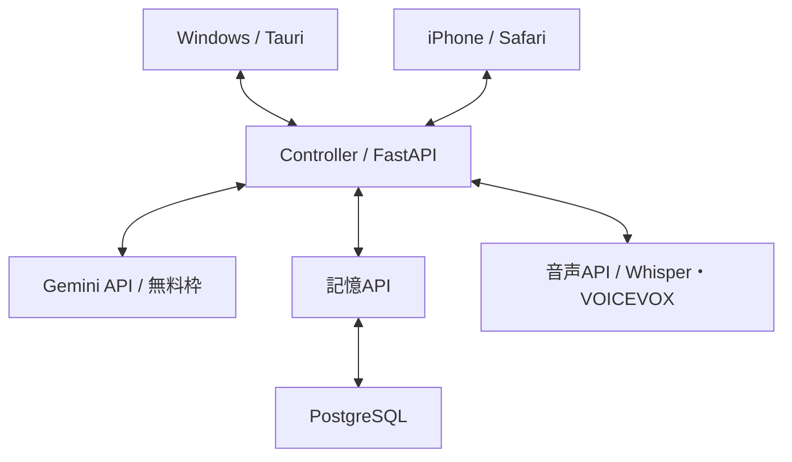

# かぐやAI — 最終仕様書・最短実装手順

版：1.0 / 作成日：2026-09-11 / 対象：個人利用の初期版

「Windows PCに住んでいるかぐやに、iPhoneからも会いに行ける」。相談と雑談を中心に、話す・聞く・考える・覚える・忘れる振る舞いを作る。

本書は会話で合意した仕様をまとめた実装基準。細かな数値は着手用の初期値として定め、利用後に変更できるようにする。アプリの実装・実機検証はまだ行っていない。

## 1. 決定事項

| 項目 | 初期版の仕様 |
|---|---|
| 主な用途 | 日常の相談、雑談。高度な作業は別のAIを使う |
| Windows | Tauriでデスクトップ常駐。トレイから表示・非表示・終了 |
| iPhone | 自宅Wi-Fi内のSafariから利用。PCと同じ記憶・会話を参照 |
| 稼働条件 | Windowsにログインし、本体が起動している間。シャットダウン・スリープ中は利用不可 |
| LLM | 個人用Gemini APIの無料枠。会話・知恵化・人格更新で同じモデルを使う |
| 費用 | 有料APIへの自動切替なし。追加のサービス利用料ゼロを目指す。電気代は別 |
| 記憶 | PC上のPostgreSQL。raw_memory / wisdom / personaの3テーブル |
| 音声 | 録音ボタンで開始・確定。Whisperで文字化、VOICEVOXで読み上げ |
| 自発的な声かけ | Windowsの吹き出しだけ。初期版は定型文。LLMを呼ばない |
| 見た目 | 美少女ドット絵、1フレーム128 × 128。黒・白・落ち着いた紫を基調 |
| 状態 | idle / listening / thinking / speaking / working |
| 通信 | 部品間はHTTP・WebSocket。暗号化時はHTTPS・WSS。DB内部は専用プロトコル |

会社のGemini Enterpriseは初期版に使わない。個人利用の可否とAPI権限が確認できた場合に別途検討する。ChatGPT等のアプリ契約枠を通常のAPI枠として扱わない。

### 初期版に入れないもの

- 外出先接続、PC停止中の会話、クラウドDB、iPhone専用ネイティブアプリ。
- 画面監視、ファイル操作、Web検索、常時録音、音声による自動割り込み。
- 複数LLMの自動振り分け、Ollamaへの自動退避、ベクトル検索。
- バックグラウンドのiPhoneへ通知・発話する機能。

## 2. 性格と言葉遣い

普段は明るく無邪気で、子供っぽく少しワガママ。親しい相手に軽口を言うが、重い相談には親身に応える。一人称は「あたし」を初期値にする。

| 場面 | 応答例 | 守ること |
|---|---|---|
| 興味がある | 「ねえねえ、それ何？ あたしにも見せて！」 | 好奇心を自然に出す |
| 軽口 | 「また夜更かし？ しょーがないなあ」 | 相手が嫌がったらやめる |
| 別れ際 | 「えー、もう終わり？ ……分かった、またね！」 | 引き止め続けない |
| 重い相談 | 「そっか……それはしんどかったね」 | 茶化さず、解決策や説教を急がない |
| 分からない話 | 「そこはちょっと分からない。もう少し教えて？」 | 知っているふりをしない |

普段は1〜3文程度。必要な相談では長さを優先せず、相手の話を聞く。「結論からいうと」「重要なのは」などの定型的な前置きを繰り返さない。毎回質問で終わらない。無視・終了・未起動を責めない。

性格はプロンプトとpersonaで管理する。深刻さの判定に別のLLMを追加せず、同じ会話モデルに応答方針として与える。基本性格は自動更新せず、相手への接し方だけ調整する。実際に気持ちや出来事を体験したかのような作り話はしない。

## 3. 画面と操作

### Windows

- 透明・枠なしの小さなキャラウィンドウ。初期表示は256 × 256相当、ドラッグで移動。
- キャラをクリックすると会話パネルを開く。履歴、入力欄、送信、録音、停止を置く。
- 最前面表示は切替可能。初期は有効。操作時以外にフォーカスを奪わない。
- トレイメニュー：会話を開く／キャラを隠す／静かにする・再開／設定／終了。
- ウィンドウを閉じる操作は非表示。トレイの「終了」で本体も止める。
- 初期は手動起動。Windowsログイン時の自動起動は動作が安定してから追加。
- 表示に使うWebのコードはiPhone用と共有し、Tauri固有処理だけ分離する。

### iPhone

- HTTPSのWeb画面をSafariで開く。キャラ、履歴、入力欄、録音ボタンを縦に配置。
- 会話する間はページを開く。ホーム画面への追加・オフラインPWAは必須にしない。
- PCに接続できない場合は「今はつながらないみたい」と表示し、再接続ボタンを出す。PCが停止したのか通信不良なのかは断定しない。
- 同じ会話を複数端末で閲覧できる。生成は全体で1件まで。別端末からの追加送信は「返事を待ってね」とし、勝手にキューへ積まない。
- 音声は入力した端末だけで再生。PC側へ二重に音を出さない。

### アセット

v7資料の絵はイメージ用。実装用には同じ衣装・輪郭で128 × 128のフレームを用意する。最短版は各状態1枚＋口の開閉差分。瞬きや呼吸のフレームは後から足す。Canvas2Dの画像補間を無効化し、整数倍率で拡大する。配布を行う段階では、キャラクター・音声の利用条件を確認する。

## 4. 自発的な声かけ

| 条件 | 動作 |
|---|---|
| アプリを起動 | 挨拶を1回。トレイからの再表示だけでは繰り返さない |
| 最後の会話から1時間経過 | 定型文の吹き出しを1回 |
| 返事がない | 次にユーザーが話すまで追加しない |
| 「静かにしてて」またはメニュー操作 | 自発的な声かけを停止。設定を保存 |
| メニューから再開 | タイマーをリセット。即座には話しかけない |
| 録音・生成・再生中、キャラ非表示、PCロック中 | 表示しない。解除後も蓄積分を連続表示しない |

定型文例：「ねえ、ちょっと休憩しない？」「今、話せる？」。画面を読んでいないため、「その仕事、大変そう」など見えているふりはしない。起動時挨拶を含め、声かけ間隔は1時間以上。停止中でも、ユーザーからの会話には応える。

タイマーはControllerが1本だけ持つ。定型文はDBの会話には保存せず、記憶の根拠にも使わない。最後の声かけ1件だけを一時保持し、返答が来たときの会話文脈に渡す。会話中の「静かにしてて」は送信前に決まった表記を検知して停止し、同じ操作をメニューでも確実に行えるようにする。

## 5. 構成と通信



| 部品 | 採用技術・責務 |
|---|---|
| UI | TypeScript + Vite + Canvas2D。初期はUIフレームワーク不要 |
| Windows外枠 | Tauri 2。透明表示、ドラッグ、トレイ、終了制御 |
| Controller | Python + FastAPI + Uvicorn、1 worker。認証、会話、状態、定期処理 |
| Gemini接続 | google-genai。単一のアダプターに閉じ、モデルIDは設定値 |
| 記憶API | 同じFastAPI内のルーター。保存・取得・整理確定を担当 |
| DB | PostgreSQL + psycopg。Windowsサービスとして起動 |
| STT | Whisper多言語baseを最初の候補。HTTPラッパー＋専用プロセス |
| TTS | VOICEVOX Engine。audio_query → synthesisの順に呼ぶ |

HTTP統一を維持するため、Controller→記憶APIも非同期HTTPで呼ぶ。同一プロセス内では往復の負荷があるが、別サーバーには分けない。ルーターをまたいだ複数回の保存をトランザクションにせず、記憶APIの1回の確定処理の中で完結させる。

DB、音声APIはloopbackのみ。記憶APIは内部専用トークンで保護し、ブラウザ用の認証では呼べないようにする。処理の重いWhisperをFastAPIのイベントループで直接実行しない。

## 6. 会話とAPIの契約

### 通常の流れ

1. UIがUUIDのturn_idを作り、text / voiceの入力種別と端末IDを送る。
2. 認証、文字数、同時実行を検査。音声の場合は先に文字化する。
3. raw_memoryへユーザー発言を1回だけ保存する。
4. 固定性格、persona、関連wisdom、直近の会話を取得する。
5. Geminiを1回呼び、回答を作る。初期は全文完成後に表示する。
6. 回答を保存し、UIへ返す。音声入力の場合だけTTSを実行する。
7. 再生終了でidleへ戻る。

同じturn_idが再送されたら、完成済みの回答を返す。生成中なら状態だけを返す。プロセス停止により生成中のまま残った発言は起動時に失敗状態へ戻す。明示的な再試行時だけ、同じ発言で再生成する。

### 外向けエンドポイント案

| 経路 | 用途 |
|---|---|
| GET /health | 起動確認。キーやDB情報は返さない |
| POST /session | 初回ペアリング・端末認証 |
| GET /history | 最新会話の取得。ページングあり |
| WS /ws | chat.send / chat.cancel / playback.endedを受信 |
| POST /audio/transcribe | 録音データを送る。textを返す |
| GET /audio/{turn_id} | 認証済みの音声取得。短時間で失効 |
| GET・PATCH /settings | 声かけ停止、表示・音声設定 |
| GET・PATCH・DELETE /memories/{layer}/{id} | 記憶の確認、訂正、削除。削除は画面で対象を確認 |

WebSocketの送信イベントはstate.changed / chat.completed / chat.error / speech.ready / proactive.message。各会話イベントにturn_idを付ける。初期版で外部APIのトークンストリーミングは実装しない。

### 状態・エラー

| 状態 | 入る条件 | 終わる条件 |
|---|---|---|
| idle | 起動・会話完了 | 入力開始 |
| listening | 録音開始 | 録音確定・取消 |
| thinking | 入力確定 | 回答準備・エラー・取消 |
| speaking | 対象端末で音声再生 | 再生完了・停止 |
| working | 初期版では使わない | 作業機能追加時に定義 |

- 文字入力はidle→thinking→idle。音声はlistening→thinking→speaking→idle。
- 429は待機時間を表示し、自動再試行しない。有料モデルへ切り替えない。
- タイムアウト・通信失敗は再送ボタンを出す。失敗文をAIの会話として記憶させない。
- DBへのユーザー発言保存が失敗したらLLMを呼ばない。回答の保存に失敗した場合は「保存できませんでした」を添えて表示し、保存のみ再試行できるようにする。
- 再生停止はUIで直ちに行い、古いspeech.readyを無視する。生成取消で外部側の処理や枠消費まで必ず止まるとは扱わない。

## 7. LLM・無料枠

個人用Google AI Studioの無料枠を使う。課金アカウントを接続しないプロジェクトで始める。無料枠の制限・提供モデルは変わるため、コードにモデル名を埋め込まない。[無料枠と価格](https://ai.google.dev/gemini-api/docs/pricing) / [利用制限](https://ai.google.dev/gemini-api/docs/rate-limits)

初期評価候補は `gemini-3.5-flash-lite`。本書作成時の料金表には無料枠があるが、ユーザーのアカウントでの利用可否・残量は未確認。実装の最初に短い日本語会話と構造化要約を試し、問題なければ `GEMINI_MODEL` に設定して確定する。採用は利用可能性と実測で決め、失敗時に勝手に別サービスを追加しない。

無料枠では入力が製品改善に使用される扱いをユーザーは了承済み。保存元はPCだが、回答・要約に必要な会話はGeminiへ送る。共有アカウントや会社の契約は混ぜない。

### 初期設定値

| 設定 | 初期値・扱い |
|---|---|
| 同時生成 | 会話1件。整理ジョブも1件まで。会話があれば新しい整理は開始しない |
| 1入力 | 最大2,000文字。超過は分割を案内 |
| 最近の会話 | 完成済みの最新10往復まで。今回の入力を二重に含めない |
| wisdom | 関連上位5件まで |
| persona | 最大12項目 |
| 全入力 | 目安4,000トークン以内。超過時は古い会話、低関連wisdomの順に省く |
| 回答 | 普段1〜3文。出力上限は1,024トークンを初期値に調整 |
| APIタイムアウト | 30秒。STT・TTSは各60秒を初期値 |
| 自動再試行 | なし。手動再試行のみ |
| 整理の予算 | 1日最大3回のLLM呼び出し。週次更新も含む。実際の無料枠が優先 |

待ち時間は実測し、同じ10〜20例で自然さ・矛盾・初回応答時間を比較する。無料枠で常時応答できる保証はない。APIの会話保存機能へ依存せず、その都度PCで選んだ文脈を送る。

## 8. DBと記憶のルール

単一ユーザーを前提とする。時刻はtimestamptzで保存し、日次・週次の判定はAsia/Tokyo。以下は実装時の論理スキーマで、SQL全文ではない。

| テーブル | 項目 |
|---|---|
| raw_memory | id UUID PK、turn_id UUID、role、content TEXT、created_at、processed_at NULL可、status、origin_client_id、input_mode |
| wisdom | id UUID PK、topic_key UNIQUE、summary TEXT、kind、support_level、importance、evidence JSONB、last_seen_at、last_used_at、revision INT、updated_at |
| persona | key TEXT PK、value JSONB、locked BOOL、source_wisdom_ids JSONB、revision INT、updated_at、previous_value JSONB |

raw_memoryはUNIQUE(turn_id, role)。1往復にユーザー発言・AI回答を各1件。statusでpending / completed / failed / cancelledを区別する。created_at、processed_atに取得用インデックスを置く。DB変更は番号付きSQLファイルで管理し、初期版はORM・独立したジョブDBを追加しない。

### 保存と検索

- 会話は追記。AIの回答は会話文脈には使うが、ユーザーに関する知恵の根拠にはしない。
- wisdom.kindはexplicit / inferred、support_levelはunconfirmed / stated / repeated。確率のような数値は付けない。
- evidenceは元発言ID、日付、最小限の根拠要旨。発言IDを重複加算しない。
- 検索は話題キーと日本語の部分一致を起点に、重要度・経過日数で並べる。言い換えに弱い点は利用テストで確認する。
- personaの固定性格はlocked=true。接し方の変更対象はlocked=falseに限定。

### 毎晩の知恵化

1. 毎日03:00、直近7日の未処理発言を取得。7日より前の取りこぼしも古い順に回収。
2. 1回最大30発言、入力上限を守る。無内容・取消は理由を記録して処理済みにできる。
3. 対象IDと既存wisdomのrevisionを控え、DBトランザクションの外でLLMを呼ぶ。
4. 出力形式、根拠ID、統合先を検証する。
5. 短いトランザクションでrevision・未処理状態を再確認し、wisdom更新とprocessed_atを同時に確定。
6. 競合時は候補を破棄して再取得。失敗時は未処理のまま残す。

起動時に未実行分を1回回収。起動直後に会話が始まった場合は後回しにする。実行済み日・週、ジョブ利用回数、声かけ設定は小さな設定ファイルへ原子的に保存する。整合性はDBの未処理状態とrevisionで保つ。別スケジューラーサービスは導入しない。

### 忘却と週次更新

- 毎晩、7日超かつ処理済みのrawのみ削除。未処理が上限10,000発言へ達したら追加保存を停止し、整理または明示削除を案内する。
- 古いwisdomは検索順位を下げる。根拠の確かさと重要度は別々に扱う。
- 毎週日曜03:00、知恵化の後にpersonaの変更候補を作る。新しい根拠がなければ呼ばない。
- 別日3日以上で確認した傾向を候補とし、1回1項目まで更新。previous_valueで直前へ戻せる。
- 「今日は詳しく」など現在の要望は即座に会話へ反映し、週次を待たない。
- 訂正・削除画面ではraw→wisdom→personaの派生情報も対象にする。rawの期限削除後も残る要旨やprevious_value、ローカル一時ファイルからの復活を防ぐ。外部送信済みデータの削除まで保証しない。

## 9. 音声仕様

録音開始→もう一度押して確定。最大30秒、サイズ上限10MB。取消時は送信しない。対応録音形式はブラウザの対応状況で選び、サーバー側でFFmpegを使ってWhisper向け音声へ変換する。

文字化した内容をUIに表示し、自動で会話へ送る。誤認識した場合は文字を修正して再送できる。初期はWhisperの多言語base、language=ja。日本語精度が不足するときだけsmallを比較する。

VOICEVOXは選んだspeaker/styleを設定値にする。音声入力への返答のみ読み上げ、文字入力や自発的な声かけでは読み上げない。音声再生は入力端末に限定し、ブラウザが自動再生を拒否したら再生ボタンを表示する。

音声データは文字化後・再生完了後に削除し、回収漏れは10分で失効。口パクは再生音量から開閉する。音声エンジンは音声機能を初めて使う時に起動・ロードし、音声モードを終えたら停止・解放する。[Whisper](https://github.com/openai/whisper) / [VOICEVOX Engine](https://github.com/VOICEVOX/voicevox_engine)

## 10. 保存・起動・認証

- 開発中は `C:\kaguya-ai`、ユーザー設定・ログは `%LOCALAPPDATA%\KaguyaAI` に分離する。
- APIキーはサーバー側の環境変数／ローカル設定のみ。UI・リポジトリ・ログには入れない。
- 通常ログはID、所要時間、エラー種別、使用量のみ。会話全文を複製しない。
- 最短版はPostgreSQLをWindowsサービス、FastAPIを開発用プロセスとして起動。DBのデータはアプリ終了でも保持。
- Tauri化後は起動時にbackendを起動し、healthを待って接続。終了時は自分が起動したbackend・音声子プロセスだけを止める。
- 単一起動を前提にし、固定ポートが別プロセスに使われていたら説明して停止。既存プロセスを勝手に終了しない。
- 個人用の初期版は開発起動で運用可能。Python同梱EXE・インストーラー作成は最後に行う。

### iPhone接続時

PC用HTTPサーバーはloopbackのまま残し、iPhone用にHTTPSの入口を追加する。入口は同じFastAPIへのリバースプロキシとし、公開ルートだけを通す。記憶の内部APIは通さない。DB・STT・TTSのポートはLANへ公開しない。

初回はPCでペアリングコードを表示し、Safariで入力して認証。短時間有効・1回限りのコードを使い、失敗回数を制限。Web側はHttpOnly・SameSiteのセッションCookie、HTTPS側はSecureを付与する。Tauriの専用ローカル認証と共通の検証層を用意し、WSでもOriginとセッションを確認する。認証情報をURLへ入れない。

## 11. 最短実装手順

**まずWindowsのブラウザで1往復を通し、その画面をTauriへ載せる。記憶・音声・iPhoneを一度に作らない。** 各工程の完了条件を満たしたら次へ進む。

### 0. 無料APIが使えることを先に確認

1. 個人用Google AI StudioでAPIキーを作成し、課金未接続のプロジェクトであることを確認する。
2. Python仮想環境にgoogle-genaiを導入し、日本語の短い会話を1回呼ぶ。
3. 候補モデルの無料枠・利用上限を自分の画面で確認し、GEMINI_MODELを決める。
4. 雑談・重い相談・「今日は短く」・訂正・要約を少数試す。失敗する場合はUI制作より先に原因を解消する。

完了条件：追加課金なしで、会話と構造化要約が成功する。APIキーをチャットへ貼る必要はない。[公式導入手順](https://ai.google.dev/gemini-api/docs/quickstart)

### 1. Windowsの開発環境を用意

| 必須 | 用途 |
|---|---|
| Python 3.11系 | FastAPI・Whisperとの組み合わせを最初に検証する基準 |
| Node.js LTS・npm | TypeScript・Vite |
| Rust stable・MSVC Build Tools・Windows SDK | Tauriのビルド |
| WebView2 Runtime | Windowsの表示エンジン |
| PostgreSQL | 記憶DB |

Tauriの前提条件は[公式手順](https://v2.tauri.app/start/prerequisites/)に従う。Whisper・FFmpeg・VOICEVOXは工程5まで入れなくてよい。Dockerは使わず、Windows上で動かす。

PowerShellでの準備例（新規フォルダーで実行）：

```powershell
mkdir C:\kaguya-ai
cd C:\kaguya-ai
mkdir backend
py -3.11 -m venv backend\.venv
& .\backend\.venv\Scripts\python.exe -m pip install fastapi 'uvicorn[standard]' google-genai 'psycopg[binary]' httpx pydantic-settings
npm create vite@latest frontend -- --template vanilla-ts
cd frontend
npm install
```

このコマンドは依存関係と雛形だけを作る。まだアプリは完成しない。後続工程で下表のファイルを実装する。動作確認後に依存バージョンを固定する。

### 2. 文字会話を動かす — 最初の到達点

| 作成するもの | 内容 |
|---|---|
| backend/app/main.py | FastAPI、health、WS、認証、例外処理 |
| backend/app/llm.py | Geminiの会話・要約呼び出しを集約。非同期クライアントを使用 |
| backend/app/memory_api.py | 内部HTTPの保存・履歴・記憶取得 |
| backend/app/config.py | キー、モデル、DB接続、上限設定 |
| backend/migrations/001_init.sql | 3テーブルと制約の作成 |
| frontend/src/main.ts | 履歴、入力、送信、状態、エラー、再送 |
| frontend/src/avatar.ts | 仮画像の表示。まずidle/thinkingだけ |
| backend/.env.example | 空のキー項目と設定例。実キーを含めない |

PostgreSQLに専用DBと最小限の権限のアプリユーザーを作り、SQLを適用。実キーはbackend/.envへ置いてGit管理から除外する。性格はまず固定のシステム指示で与える。

実装後の起動例：

```powershell
# C:\kaguya-ai\backend で実行
& .\.venv\Scripts\python.exe -m uvicorn app.main:app --host 127.0.0.1 --port 8765
```

別ターミナルでfrontendから `npm run dev -- --host 127.0.0.1` を実行する。開発用Originを明示許可し、初回認証してWSへ接続する。

完了条件：送信→返答→DB保存→再起動後の履歴表示。再送・429・保存失敗も扱える。この時点で文字会話の試用を始められる。

### 3. Tauriで常駐させる

frontendでTauri CLI・APIを追加し、既存Viteを利用する形で初期化する。

```powershell
npm install @tauri-apps/api
npm install -D @tauri-apps/cli
npx tauri init
```

Viteの開発URLとdistを設定。透明ウィンドウ、ドラッグ、トレイ、非表示、単一起動を実装する。Tauri側の通信許可・CSPにloopback接続先を必要な分だけ設定する。backendの起動管理を追加し、トレイ終了で停止する。

完了条件：キャラを動かせる、会話を開ける、閉じても常駐する、終了で子プロセスが残らない。[トレイ](https://v2.tauri.app/learn/system-tray/) / [外部実行ファイルの同梱](https://v2.tauri.app/develop/sidecar/)

### 4. 記憶と自発的な声かけを追加

- backend/app/jobs.py：日次・週次処理。開発中は「今すぐ整理」で同じ処理を呼ぶ。
- backend/app/persona.py：固定性格、変更可能な接し方、プロンプト組立。
- backend/app/proactive.py：1時間タイマー、返事待ち、静音設定、起動挨拶。
- UI：記憶一覧・訂正・削除、静音切替。

完了条件：好みを翌会話で使う、訂正が効く、整理失敗で原文を失わない、再実行で根拠が増えない。タイマーの時刻をテスト用に進め、1回だけ声をかけることを確認する。

### 5. ボタン式音声を追加

1. FFmpeg・Whisper・VOICEVOX Engineを用意する。
2. 音声APIをloopbackで起動。STTを専用プロセスで処理する。
3. ブラウザの録音→文字化→既存の文字会話へ接続する。
4. VOICEVOXの話者を実際に聞いて選び、speaker/styleを保存する。
5. 音声入力への返答だけTTS再生。口パクと停止を追加する。

完了条件：30秒以内の日本語録音で会話できる。取消、無音、誤認識、再生拒否、TTS失敗から復帰する。実用上の待ち時間を測る。

### 6. iPhoneを自宅Wi-Fiで接続

1. `npm run build` の出力をFastAPIで配信し、UIと公開APIを同じWeb起点にまとめる。
2. PCのLANアドレスをルーターのDHCP予約で固定する。
3. mkcertでPCのLANアドレスを含む証明書を作る。
4. iPhoneへ**ルート証明書だけ**を入れ、設定で信頼を有効にする。CAの秘密鍵は転送しない。
5. 軽量なHTTPSリバースプロキシを追加し、公開ルートとWSのみを8765へ転送する。初期採用はCaddy。[リバースプロキシ](https://caddyserver.com/docs/caddyfile/directives/reverse_proxy)と[証明書指定](https://caddyserver.com/docs/caddyfile/directives/tls)を設定し、公衆向けの公開は行わない。
6. WindowsファイアウォールでHTTPS入口だけをプライベートネットワーク・自宅サブネットに限定して許可する。
7. SafariでHTTPSのURLを開き、PC側のコードでペアリングする。

mkcertの証明書作成例。`192.168.1.20` は実際のPCのアドレスへ置換する。

```powershell
mkcert -install
mkcert -cert-file kaguya.pem -key-file kaguya-key.pem 192.168.1.20 localhost 127.0.0.1
```

Safariの録音には安全な接続が必要。単に `http://PCのIP` を開くだけでは音声まで完成しない。[録音API](https://developer.mozilla.org/en-US/docs/Web/API/MediaDevices/getUserMedia) / [mkcertのiOS設定](https://github.com/FiloSottile/mkcert#mobile-devices)

完了条件：同じ記憶で文字・音声会話ができ、音がiPhoneだけで出る。画面ロック後の復帰、PC停止、Wi-Fi切断でも固まらない。

### 7. 普段使い向けに仕上げる

起動用ショートカット、設定場所、エラーの見方を整える。Python同梱が必要なら実行ファイル化してTauriのsidecarにまとめる。PostgreSQL・VOICEVOXまで初めから単一インストーラーへ詰め込まない。

最初の目標は「開発用起動で毎日使える状態」。配布・自動更新・外出先接続は、その後の別工程にする。

## 12. 提出前・実装完了時の確認

| 確認 | 合格条件 |
|---|---|
| 追加費用 | 無料プロジェクトで稼働。有料切替・再試行ループなし |
| 性格 | 雑談は無邪気、重い相談は茶化さない。返答の催促をしない |
| 会話 | 再送で二重保存しない。API失敗と通常返答を区別 |
| 記憶 | 未処理を自動削除しない。AI発言を本人の事実にしない |
| 訂正 | 派生wisdom・personaにも反映。古い候補から復活しない |
| 声かけ | 間隔1時間以上。返事がなければ止まる。静音を保持 |
| 音声 | ボタンで開始・取消・停止。送信した端末だけで再生 |
| iPhone | HTTPS・認証あり。内部APIとDBへ直接アクセスできない |
| 終了 | PC本体停止時は接続不可を表示。子プロセスの残留なし |

文書セルフレビュー：会話で合意した範囲、無料枠、音声を出す条件、PCの稼働条件、記憶の更新と削除、HTTP統一とDB接続の例外、開発起動と配布の違いを照合済み。モデルの実利用枠、話者、待ち時間は実機での選定項目として明記した。
